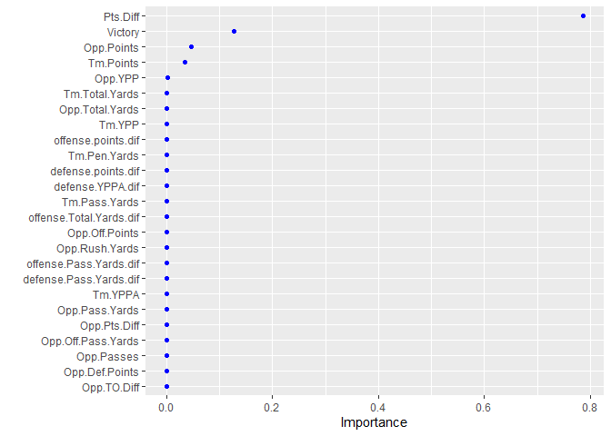

Predictive Modeling with Random Forests and XGBoost
===================================================

### Loading relevant packages

``` r
library(tidyverse)
library(recipes)
library(caret)
library(ranger)
library(vip)
library(xgboost)
```

### Reading the dataset in CSV

``` r
inFile <- "cfb_final.csv"
cfb.random <- read.csv(inFile)
```

### Part 1 - Data Preparation, Wrangling and Preprocessing

Picking up only the relevant variables a) your conference, opponent
conference, and conference game variables. b) All continuous variable
except for Spread, Victory

``` r
columns_of_interest <- c(4, 7, 14, 23, 25:37, 39:53, 56, 58:70, 72:102, 107:113, 116)
```

Checking the Conf.Game variable

``` r
with(cfb.random, table(Conf.Game))
```

    ## Conf.Game
    ##        CCG Conf Champ          N          Y 
    ##         23          7        804       2194

Correcting some values

``` r
cfb.random <- cfb.random %>%
  mutate(
    conf_game2 = ifelse(Conf.Game == "CCG" | Conf.Game == "Conf Champ", 
                        "Y", 
                        Conf.Game)
  )
```

Inspecting the corrected variable (conf\_game2)

``` r
with(cfb.random, table(conf_game2))
```

    ## conf_game2
    ##    N    Y 
    ##  804 2224

Inspecting the Conference variable

``` r
with(cfb.random, table(Conference))
```

    ## Conference
    ##         AAC         ACC      Big 10      Big 12    Big East        CUSA 
    ##         162         350         326         268          87         291 
    ## Independent         MAC         MWC      Pac 12      PAC 12         SEC 
    ##         101         293         289           1         336         347 
    ##    Sun Belt         WAC 
    ##         119          58

``` r
cfb.random[cfb.random$Conference == "Pac 12", "Conference"] <- "PAC 12"
with(cfb.random, table(Conference))
```

    ## Conference
    ##         AAC         ACC      Big 10      Big 12    Big East        CUSA 
    ##         162         350         326         268          87         291 
    ## Independent         MAC         MWC      PAC 12         SEC    Sun Belt 
    ##         101         293         289         337         347         119 
    ##         WAC 
    ##          58

Inspecting the Opp.Conference variable

``` r
with(cfb.random, table(Opp.Conference))
```

    ## Opp.Conference
    ##         AAC         ACC      Big 10      Big 12      Big 19    Big East 
    ##         175         335         342         274           1          80 
    ##        CUSA Independent         MAC         MWC      PAC 12         SEC 
    ##         278         108         292         281         319         354 
    ##    Sun Belt         WAC 
    ##         128          61

``` r
cfb.random[cfb.random$Opp.Conference == "Big 19", ]
```

    ##      Year Game Count Conf.Game Week    Team Conference Tm.HAN Tm.FU Tm.Cover
    ## 1472 2011  702     1         N   99 Houston       CUSA      N     F        Y
    ##      Tm.OU Field25        Opp Opp.Conference Opp.HAN Opp.FU Opp.Cover Opp.OU OT
    ## 1472     U      NA Penn State         Big 19       N      U         N      U  N
    ##      Thursday TOP.VERIFICATION OU.Total Tm.Points Tm.Spread Tm.Passes
    ## 1472        N             3600       NA  50.33333  30.58333  46.91667
    ##      Tm.Pass.Yards  Tm.YPPA Tm.Rush.Attempts Tm.Rush.Yards Tm.YPRA
    ## 1472           434 9.493333         30.41667      153.9167  5.2025
    ##      Tm.Total.Plays Tm.Total.Yards   Tm.YPP    Tm.TO Tm.Pen.Yards Tm.TOP
    ## 1472       77.33333       587.9167 7.811667 1.083333     47.41667   1577
    ##      Opp.Points Opp.Spread Opp.Passes Opp.Pass.Yards Opp.YPPA Opp.Rush.Attempts
    ## 1472         25   30.58333   34.58333            221 6.574167          41.41667
    ##      Opp.Rush.Yards Opp.YPRA Opp.Total.Plays Opp.Total.Yards  Opp.YPP   Opp.TO
    ## 1472         168.75 3.824167              76          389.75 5.153333 2.166667
    ##      Opp.Pen.Yards Opp.TOP   Victory Pts.Diff  TO.Diff Victory.1 Pts.Diff.1
    ## 1472            51    2023 0.9166667 25.33333 1.083333         1         16
    ##      Opp.Off.Points Opp.Off.Spread Opp.Off.Passes Opp.Off.Pass.Yards
    ## 1472       17.81818       50.27273       29.90909           186.3636
    ##      Opp.Off.YPPA Opp.Off.Rush.Attempts Opp.Off.Rush.Yards Opp.Off.YPRA
    ## 1472     6.185455              38.45455           157.8182     4.096364
    ##      Opp.Off.Total.Plays Opp.Off.Total.Yards Opp.Off.YPP Opp.Off.TO
    ## 1472            68.36364            344.1818    5.069091          2
    ##      Opp.Off.Pen.Yards Opp.Off.TOP Opp.Def.Points Opp.Def.Spread Opp.Def.Passes
    ## 1472          42.27273    1786.818       16.45455       50.27273       30.45455
    ##      Opp.Def.Pass.Yards Opp.Def.YPPA Opp.Def.Rush.Attempts Opp.Def.Rush.Yards
    ## 1472           167.3636     5.437273              39.54545           145.4545
    ##      Opp.Def.YPRA Opp.Def.Total.Plays Opp.Def.Total.Yards Opp.Def.YPP
    ## 1472     3.576364                  70            312.8182    4.456364
    ##      Opp.Def.TO Opp.Def.Pen.Yards Opp.Def.TOP Opp.Victory Opp.Pts.Diff
    ## 1472   2.090909          37.81818    1813.182   0.7272727     1.363636
    ##      Opp.TO.Diff offense.points.dif defense.points.dif offense.YPPA.dif
    ## 1472  0.09090909           33.87879           7.181818         4.056061
    ##      defense.YPPA.dif offense.YPRA.dif defense.YPRA.dif offense.Pass.Yards.dif
    ## 1472        0.3887121         1.626136        -0.272197               266.6364
    ##      defense.Pass.Yards.dif offense.Rush.Yards.dif defense.Rush.Yards.dif
    ## 1472               34.63636               8.462121               10.93182
    ##      TO.Diff.dif Victory.dif offense.Total.Plays.dif defense.Total.Plays.dif
    ## 1472   0.9924242   0.1893939                7.333333                7.636364
    ##      offense.Total.Yards.dif defense.Total.Yards.dif Home.Binary original.order
    ## 1472                275.0985                45.56818           0           1822
    ##      matchup.num Class_Points recruit_lag1 recruit_lag2 recruit_lag3
    ## 1472        1472       134.24       165.99       151.26       120.47
    ##      recruit_lag4 recruit_2avg recruit_3avg recruit_4avg home.ind away.ind
    ## 1472       138.01      158.625     145.9067     143.9325        0        0
    ##      field.status game.id conf_game2
    ## 1472            0 2011702          N

``` r
cfb.random[1472, "Team"]
```

    ## [1] "Houston"

``` r
cfb.random[1472, "Opp.Conference"] <- "AAC"
with(cfb.random, table(Opp.Conference))
```

    ## Opp.Conference
    ##         AAC         ACC      Big 10      Big 12    Big East        CUSA 
    ##         176         335         342         274          80         278 
    ## Independent         MAC         MWC      PAC 12         SEC    Sun Belt 
    ##         108         292         281         319         354         128 
    ##         WAC 
    ##          61

Generating train and test data:

``` r
cfb.train <- subset(cfb.random, Year < 2015)
cfb.train <- subset(cfb.train, Team != 'UTSA' & Opp != 'UTSA')
cfb.train <- cfb.train[, columns_of_interest]

cfb.test <- subset(cfb.random, Year == 2015)
cfb.test <- subset(cfb.test, Team != 'UTSA' & Opp != 'UTSA')
cfb.test <- cfb.test[, columns_of_interest]
```

Preprocessing the data: 1) Applied the Yeo-Johnson transformation to all
continuous variables. 2) Centered and scaled all continuous predictors.
3) Created dummy variables for your conference, opponent conference, and
conference game variables.

``` r
cfb_recipe <- recipe(Pts.Diff ~ ., data = cfb.train) %>%
  step_YeoJohnson(all_numeric()) %>%
  step_center(all_predictors(), -all_nominal()) %>%
  step_scale(all_predictors(), -all_nominal()) %>%
  step_dummy(all_nominal())

prepare_cfb <- prep(cfb_recipe, training = cfb.train)

bake_cfb.train <- bake(prepare_cfb, new_data=cfb.train)

bake_cfb.test <- bake(prepare_cfb, new_data=cfb.test)
```

### Part 2 - Base model (Linear Regression)

1.  Training data RMSE

``` r
base_model_train <- train(
  Pts.Diff ~ .,
  data = bake_cfb.train,
  method = "lm"
)
train_rmse <- base_model_train$results$RMSE
```

1.  Test data RMSE

``` r
test.predict <- predict(base_model_train, bake_cfb.test)
RMSE(test.predict, bake_cfb.test$Pts.Diff)
```

    ## [1] 0.3923774

1.  Converting the predicted outcome and the test data to a binary
    win/loss

``` r
converted.prediction <- factor(ifelse(test.predict > 0, "win", "loss"))
converted.test <- factor(ifelse(bake_cfb.test$Pts.Diff > 0, "win", "loss"))
```

1.  Confusion Matrix

``` r
confusionMatrix(converted.prediction, converted.test)
```

    ## Confusion Matrix and Statistics
    ## 
    ##           Reference
    ## Prediction loss win
    ##       loss  265   0
    ##       win     4 311
    ##                                           
    ##                Accuracy : 0.9931          
    ##                  95% CI : (0.9824, 0.9981)
    ##     No Information Rate : 0.5362          
    ##     P-Value [Acc > NIR] : <2e-16          
    ##                                           
    ##                   Kappa : 0.9861          
    ##                                           
    ##  Mcnemar's Test P-Value : 0.1336          
    ##                                           
    ##             Sensitivity : 0.9851          
    ##             Specificity : 1.0000          
    ##          Pos Pred Value : 1.0000          
    ##          Neg Pred Value : 0.9873          
    ##              Prevalence : 0.4638          
    ##          Detection Rate : 0.4569          
    ##    Detection Prevalence : 0.4569          
    ##       Balanced Accuracy : 0.9926          
    ##                                           
    ##        'Positive' Class : loss            
    ## 

Reporting the accuracy of the base model

### Part 3 - Random Forest Model

Base Random Forest Model

``` r
cfb.ranger.default <- ranger(Pts.Diff ~ ., data = bake_cfb.train)

default.ranger.rmse <- sqrt(cfb.ranger.default$prediction.error)
```

#### Hyperparameter Tuning

Now we see how hyperparameter tuning can improve our model fit. We tune
*m*<sub>*t**r**y*</sub>, the minimum node size, the fraction of
observations that are sampled, and whether or not we sample with
replacement. Note there are 120 combinations of tuning parameters! The
top 10 models are output below, and you can use the output to estimate
improvement over both the default ranger settings and the original
linear model.

``` r
##Define hypergrid
hyper_grid <- expand.grid(
  mtry = floor((length(colnames(bake_cfb.train))-1) * c(.05, .15, .25, .333, .4)),
  min.node.size = c(1, 3, 5, 10), 
  replace = c(TRUE, FALSE),                               
  sample.fraction = c(.5, .75, 1)                                            
)

start_time <- Sys.time()

##Full cartesian grid search
for(i in seq_len(nrow(hyper_grid))) {
  ##ith hyperparameter combination
  fit <- ranger(
    formula         = Pts.Diff ~ ., 
    data            = bake_cfb.train, 
    num.trees       = 10*length(length(colnames(bake_cfb.train))-1),
    mtry            = hyper_grid$mtry[i],
    min.node.size   = hyper_grid$min.node.size[i],
    replace         = hyper_grid$replace[i],
    sample.fraction = hyper_grid$sample.fraction[i],
    verbose         = FALSE,
    seed            = 123,
    respect.unordered.factors = 'order',
    num.threads     = 7
  )
  ##Save OOB error 
  hyper_grid$rmse[i] <- sqrt(fit$prediction.error)
}

end_time <- Sys.time()

##Time elapsed
end_time - start_time
```

    ## Time difference of 13.81556 secs

``` r
##Top 10 models
hyper_grid %>%
  arrange(rmse) %>%
  mutate(perc_gain = (train_rmse - rmse) / train_rmse * 100) %>%
  head(5)
```

    ##   mtry min.node.size replace sample.fraction     rmse perc_gain
    ## 1   43            10    TRUE            1.00 3.088995 -787.5287
    ## 2   43             3    TRUE            1.00 3.100035 -790.7007
    ## 3   43             5    TRUE            0.75 3.123469 -797.4337
    ## 4   43            10    TRUE            0.75 3.126396 -798.2748
    ## 5   43             1    TRUE            1.00 3.149081 -804.7924

Fitting the final model and calculating the RMSE of it in test data

``` r
  fit <- ranger(
    formula         = Pts.Diff ~ ., 
    data            = bake_cfb.train, 
    num.trees       = 10*length(length(colnames(bake_cfb.train))-1),
    mtry            = 43,
    min.node.size   = 10,
    replace         = TRUE,
    sample.fraction = 1.00,
    verbose         = FALSE,
    seed            = 123,
    respect.unordered.factors = 'order',
    importance      = 'impurity'
  )
rf.test.predict <- predict(fit,bake_cfb.test)
RMSE(rf.test.predict$predictions, bake_cfb.test$Pts.Diff)
```

    ## [1] 2.512517

Reporting a simple confustion matrix on your converted predictions for
the test data and the overall accuracy for your test data set.

``` r
converted.rf.prediction <- factor(ifelse(rf.test.predict$predictions > 0, "win", "loss"))
confusionMatrix(converted.rf.prediction, converted.test)
```

    ## Confusion Matrix and Statistics
    ## 
    ##           Reference
    ## Prediction loss win
    ##       loss  260  12
    ##       win     9 299
    ##                                           
    ##                Accuracy : 0.9638          
    ##                  95% CI : (0.9452, 0.9775)
    ##     No Information Rate : 0.5362          
    ##     P-Value [Acc > NIR] : <2e-16          
    ##                                           
    ##                   Kappa : 0.9273          
    ##                                           
    ##  Mcnemar's Test P-Value : 0.6625          
    ##                                           
    ##             Sensitivity : 0.9665          
    ##             Specificity : 0.9614          
    ##          Pos Pred Value : 0.9559          
    ##          Neg Pred Value : 0.9708          
    ##              Prevalence : 0.4638          
    ##          Detection Rate : 0.4483          
    ##    Detection Prevalence : 0.4690          
    ##       Balanced Accuracy : 0.9640          
    ##                                           
    ##        'Positive' Class : loss            
    ## 

Providing a variable importance plot.

``` r
vip(fit, num_features = 25, geom='point', aesthetics = list(color = "blue"))
```

 \#\#\# Part
4 - XGBoost Modelling

``` r
X <- as.matrix(bake_cfb.train)
Y <- bake_cfb.train$Pts.Diff
```

#### Hyperparameter Tuning

Step 1: Tune eta

``` r
hyper_grid1 <- expand.grid(
  eta = c(0.3, 0.1, 0.05, 0.01, 0.005),
  rmse = 0,          # a place to dump RMSE results
  trees = 0          # a place to dump required number of trees
)

for(i in seq_len(nrow(hyper_grid1))) {
  set.seed(123)
  m <- xgb.cv(
    data = X,
    label = Y,
    nrounds = 4000,
    objective = "reg:squarederror",
    early_stopping_rounds = 50, 
    nfold = 10,
    verbose = 0,
    params = list( 
      eta = hyper_grid1$eta[i]
    ) 
  )
  hyper_grid1$rmse[i] <- min(m$evaluation_log$test_rmse_mean)
  hyper_grid1$trees[i] <- m$best_iteration
}

# results
hyper_grid1 %>%
  filter(rmse > 0) %>%
  arrange(rmse) %>%
  glimpse()
```

eta = 0.01 had the best result in terms of RMSE.

Step 2: Tune tree-specific hyperparameters

The tree-specific hyperparameters are `max_depth` and
`min_child_weight`.

``` r
hyper_grid2 <- expand.grid(
  eta = 0.01,
  max_depth = c(1, 3, 5, 7),
  min_child_weight = c(5, 10, 15),
  rmse = 0,          # a place to dump RMSE results
  trees = 0          # a place to dump required number of trees
)

for(i in seq_len(nrow(hyper_grid2))) {
  set.seed(123)
  m <- xgb.cv(
    data = X,
    label = Y,
    nrounds = 4000,
    objective = "reg:squarederror",
    early_stopping_rounds = 50, 
    nfold = 10,
    verbose = 0,
    params = list( 
      eta = hyper_grid2$eta[i], 
      max_depth = hyper_grid2$max_depth[i],
      min_child_weight = hyper_grid2$min_child_weight[i]
    ) 
  )
  hyper_grid2$rmse[i] <- min(m$evaluation_log$test_rmse_mean)
  hyper_grid2$trees[i] <- m$best_iteration
}

# results
hyper_grid2 %>%
  filter(rmse > 0) %>%
  arrange(rmse) %>%
  glimpse()
```

As in Section 12.3.3, we temporarily reduce the learning rate and
increase the number of trees to see if performance improves. It does not
(RMSE = 0.3229882).

``` r
  m <- xgb.cv(
    data = X,
    label = Y,
    nrounds = 8000,
    objective = "reg:squarederror",
    early_stopping_rounds = 50, 
    nfold = 10,
    verbose = 0,
    params = list( 
      eta = 0.01, 
      max_depth = 7,
      min_child_weight = 5
    ) 
  )
  temp.rmse <- min(m$evaluation_log$test_rmse_mean)
  temp.trees <- m$best_iteration
  
temp.rmse
temp.trees
```

Step 3: Explore stochastic GBM attributes

In XGBoost, these parameters are `subsample`, `colsample_bytree`, and
`colsample_bynode`.

``` r
hyper_grid3 <- expand.grid(
  eta = 0.01,
  max_depth = 7,
  min_child_weight = 5,
  subsample = c(0.5, 0.75, 1),
  colsample_bytree = c(0.5, 0.75, 1),
  colsample_bynode = c(0.5, 0.75, 1),
  rmse = 0,          # a place to dump RMSE results
  trees = 0          # a place to dump required number of trees
)

for(i in seq_len(nrow(hyper_grid3))) {
  set.seed(123)
  m <- xgb.cv(
    data = X,
    label = Y,
    nrounds = 4000,
    objective = "reg:squarederror",
    early_stopping_rounds = 50, 
    nfold = 10,
    verbose = 0,
    params = list( 
      eta = hyper_grid3$eta[i], 
      max_depth = hyper_grid3$max_depth[i],
      min_child_weight = hyper_grid3$min_child_weight[i],
      subsample = hyper_grid3$subsample[i],
      colsample_bytree = hyper_grid3$colsample_bytree[i],
      colsample_bynode = hyper_grid3$colsample_bynode[i]
    ) 
  )
  hyper_grid3$rmse[i] <- min(m$evaluation_log$test_rmse_mean)
  hyper_grid3$trees[i] <- m$best_iteration
}

# results
hyper_grid3 %>%
  filter(rmse > 0) %>%
  arrange(rmse) %>%
  glimpse()
```

Step 4: Explore Regularization Parameters

This includes `gamma`, `alpha`, and `lambda`.

``` r
hyper_grid4 <- expand.grid(
  eta = 0.01,
  max_depth = 3, 
  min_child_weight = 10,
  subsample = 1, 
  colsample_bytree = 1,
  colsample_bynode = 0.75,
  gamma = c(0, 1, 10, 100),
  lambda = c(0, 1e-2, 0.1, 1, 100, 1000),
  alpha = c(0, 1e-2, 0.1, 1, 100, 1000),
  rmse = 0,          # a place to dump RMSE results
  trees = 0          # a place to dump required number of trees
)

# grid search
for(i in seq_len(nrow(hyper_grid4))) {
  set.seed(123)
  m <- xgb.cv(
    data = X,
    label = Y,
    nrounds = 4000,
    objective = "reg:squarederror",
    early_stopping_rounds = 50, 
    nfold = 10,
    verbose = 0,
    params = list( 
      eta = hyper_grid4$eta[i], 
      max_depth = hyper_grid4$max_depth[i],
      min_child_weight = hyper_grid4$min_child_weight[i],
      subsample = hyper_grid4$subsample[i],
      colsample_bytree = hyper_grid4$colsample_bytree[i],
      colsample_bynode = hyper_grid4$colsample_bynode[i],
      gamma = hyper_grid4$gamma[i], 
      lambda = hyper_grid4$lambda[i], 
      alpha = hyper_grid4$alpha[i]
    ) 
  )
  hyper_grid4$rmse[i] <- min(m$evaluation_log$test_rmse_mean)
  hyper_grid4$trees[i] <- m$best_iteration
}

# results
hyper_grid4 %>%
  filter(rmse > 0) %>%
  arrange(rmse) %>%
  glimpse()
```

Step 5: Re-tune Learning Rate

Fixing all the hyperparameters above, we now attempt to re-tune `eta`.
Results not pictures, but 0.01 was still the optimal value.

``` r
hyper_grid5 <- expand.grid(
  eta = c(0.3, 0.1, 0.05, 0.01, 0.005),
  max_depth = 3, 
  min_child_weight = 10,
  subsample = 1, 
  colsample_bytree = 1,
  colsample_bynode = 0.75,
  gamma = 1,
  lambda = 0.01,
  alpha = 0.1,
  rmse = 0,          # a place to dump RMSE results
  trees = 0          # a place to dump required number of trees
)

for(i in seq_len(nrow(hyper_grid5))) {
  set.seed(123)
  m <- xgb.cv(
    data = X,
    label = Y,
    nrounds = 4000,
    objective = "reg:squarederror",
    early_stopping_rounds = 50, 
    nfold = 10,
    verbose = 0,
    params = list( 
      eta = hyper_grid5$eta[i], 
      max_depth = hyper_grid5$max_depth[i],
      min_child_weight = hyper_grid5$min_child_weight[i],
      subsample = hyper_grid5$subsample[i],
      colsample_bytree = hyper_grid5$colsample_bytree[i],
      colsample_bynode = hyper_grid5$colsample_bynode[i],
      gamma = hyper_grid5$gamma[i], 
      lambda = hyper_grid5$lambda[i], 
      alpha = hyper_grid5$alpha[i]
    ) 
  )
  hyper_grid5$rmse[i] <- min(m$evaluation_log$test_rmse_mean)
  hyper_grid5$trees[i] <- m$best_iteration
}

# results
hyper_grid5 %>%
  filter(rmse > 0) %>%
  arrange(rmse) %>%
  glimpse()
```

Step 6: Fit the Final Model

``` r
# optimal parameter list
params <- list(
  eta = 0.01,
  max_depth = 3, 
  min_child_weight = 10,
  subsample = 1, 
  colsample_bytree = 1,
  colsample_bynode = 0.75,
  gamma = 1,
  lambda = 0.01,
  alpha = 0.1
)

# train final model
xgb.fit.final <- xgboost(
  params = params,
  data = X,
  label = Y,
  nrounds = 650,
  objective = "reg:squarederror",
  verbose = 0
)
```

#### Variable Importance Plot (XGBoost)

``` r
vip(xgb.fit.final, num_features = 25, geom='point', aesthetics = list(color = "blue"))
```

    ## Warning: `as.tibble()` is deprecated as of tibble 2.0.0.
    ## Please use `as_tibble()` instead.
    ## The signature and semantics have changed, see `?as_tibble`.
    ## This warning is displayed once every 8 hours.
    ## Call `lifecycle::last_warnings()` to see where this warning was generated.



### Conclusions

The three models are quite close in performance for this data. The top
performer is the random forest, which is an improvement of about 0.04%
above the linear regression model. All that work for not much reward!!

``` r
xgboost.cfb.pred <- predict(xgb.fit.final, as.matrix(bake_cfb.test))
converted.xgboost.prediction <- factor(ifelse(xgboost.cfb.pred > 0, "win", "loss"))
confusionMatrix(converted.xgboost.prediction, converted.test)
```

    ## Confusion Matrix and Statistics
    ## 
    ##           Reference
    ## Prediction loss win
    ##       loss  266   3
    ##       win     3 308
    ##                                           
    ##                Accuracy : 0.9897          
    ##                  95% CI : (0.9776, 0.9962)
    ##     No Information Rate : 0.5362          
    ##     P-Value [Acc > NIR] : <2e-16          
    ##                                           
    ##                   Kappa : 0.9792          
    ##                                           
    ##  Mcnemar's Test P-Value : 1               
    ##                                           
    ##             Sensitivity : 0.9888          
    ##             Specificity : 0.9904          
    ##          Pos Pred Value : 0.9888          
    ##          Neg Pred Value : 0.9904          
    ##              Prevalence : 0.4638          
    ##          Detection Rate : 0.4586          
    ##    Detection Prevalence : 0.4638          
    ##       Balanced Accuracy : 0.9896          
    ##                                           
    ##        'Positive' Class : loss            
    ## 

Comparison among the models

``` r
#base.rmse
base.rmse <- RMSE(test.predict, bake_cfb.test$Pts.Diff)
#rf.rmse
rf.rmse <- RMSE(rf.test.predict$predictions, bake_cfb.test$Pts.Diff)
#xgboost.rmse
xgboost.rmse <- RMSE(xgboost.cfb.pred, bake_cfb.test$Pts.Diff)

print(paste0("The Base Model (multiple linear regression) RMSE is equal to ", round(base.rmse,3)))
```

    ## [1] "The Base Model (multiple linear regression) RMSE is equal to 0.392"

``` r
print(paste0("The Random Forest RMSE is equal to ", round(rf.rmse,3)))
```

    ## [1] "The Random Forest RMSE is equal to 2.513"

``` r
print(paste0("The XGBoost RMSE is equal to ", round(xgboost.rmse,3)))
```

    ## [1] "The XGBoost RMSE is equal to 0.645"
