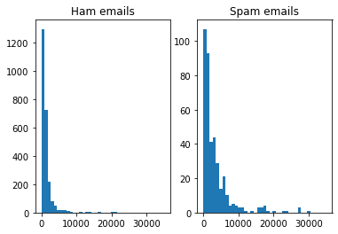

# Spam Classification

In this project we are going to explore Ham and Spam emails provided at https://www.kaggle.com/veleon/ham-and-spam-dataset and test the performance of Random Forest and Gradient Boosting algorithms in predicting the Spam emails.
The database contains email files. In this project I'll import them, explore them, create features and train some models based on the data to classify Spams.

## Summary

### 1 - Reading, Analyzing and Cleaning Text
### 2 - Feature Engineering
### 3 - Building Machine Learning Classifiers: Model selection using grid search and 5-fold cross-validation
### 4 - Building Machine Learning Classifiers: Final evaluation of the best model

Loading packages


```python
import time
import os
import re
import pandas as pd
import numpy as np
import email
import email.policy
from bs4 import BeautifulSoup
from sklearn.model_selection import train_test_split
from sklearn.feature_extraction.text import TfidfVectorizer, CountVectorizer
from sklearn.model_selection import GridSearchCV
from sklearn.ensemble import RandomForestClassifier, GradientBoostingClassifier
from sklearn.metrics import precision_recall_fscore_support as score
import matplotlib.pyplot as plt
import numpy as np
%matplotlib inline
```

## 1 - Reading, Analyzing and Cleaning Text

Counting the number of Ham and Spam files


```python
email_path = 'input/hamnspam/'
ham_path = email_path+ 'ham/'
spam_path = email_path+ 'spam/'
ham_filenames = os.listdir(ham_path)
spam_filenames = os.listdir(spam_path)
print('Number of Spam emails:', len(spam_filenames))
print('Number of Ham emails:', len(ham_filenames))
print('Spam percentage: ',round(100*(len(spam_filenames)/(len(ham_filenames)+len(spam_filenames))),2),"%")
```

    Number of Spam emails: 501
    Number of Ham emails: 2551
    Spam percentage:  16.42 %
    

Opening Emails


```python
def load_email(path, filename):
    with open(os.path.join(path, filename), 'rb') as file:
          email_file = email.parser.BytesParser(policy=email.policy.default).parse(file)
    return email_file
ham_emails = [load_email(ham_path, filename) for filename in ham_filenames]
spam_emails = [load_email(spam_path, filename) for filename in spam_filenames]
```

Checking the email data


```python
print(ham_emails[2].get_content())
```

    Man Threatens Explosion In Moscow 
    
    Thursday August 22, 2002 1:40 PM
    MOSCOW (AP) - Security officers on Thursday seized an unidentified man who
    said he was armed with explosives and threatened to blow up his truck in
    front of Russia's Federal Security Services headquarters in Moscow, NTV
    television reported.
    The officers seized an automatic rifle the man was carrying, then the man
    got out of the truck and was taken into custody, NTV said. No other details
    were immediately available.
    The man had demanded talks with high government officials, the Interfax and
    ITAR-Tass news agencies said. Ekho Moskvy radio reported that he wanted to
    talk with Russian President Vladimir Putin.
    Police and security forces rushed to the Security Service building, within
    blocks of the Kremlin, Red Square and the Bolshoi Ballet, and surrounded the
    man, who claimed to have one and a half tons of explosives, the news
    agencies said. Negotiations continued for about one and a half hours outside
    the building, ITAR-Tass and Interfax reported, citing witnesses.
    The man later drove away from the building, under police escort, and drove
    to a street near Moscow's Olympic Penta Hotel, where authorities held
    further negotiations with him, the Moscow police press service said. The
    move appeared to be an attempt by security services to get him to a more
    secure location. 
    
    ------------------------ Yahoo! Groups Sponsor ---------------------~-->
    4 DVDs Free +s&p Join Now
    http://us.click.yahoo.com/pt6YBB/NXiEAA/mG3HAA/7gSolB/TM
    ---------------------------------------------------------------------~->
    
    To unsubscribe from this group, send an email to:
    forteana-unsubscribe@egroups.com
    
     
    
    Your use of Yahoo! Groups is subject to http://docs.yahoo.com/info/terms/ 
    
    
    
    
    


```python
email_subject = ham_emails[2].get_all('Subject')
email_from = ham_emails[2].get_all('From')
email_to = ham_emails[2].get_all('To')

print('Email from: ',email_from)
print('Email to: ',email_to)
print('Email subject: ',email_subject)
```

    Email from:  ['Tim Chapman <timc@2ubh.com>']
    Email to:  ['zzzzteana <zzzzteana@yahoogroups.com>']
    Email subject:  ['[zzzzteana] Moscow bomber']
    

Transforming Emails into plaintext


```python
from collections import Counter

def get_email_structure(email):
    if isinstance(email, str):
        return email
    payload = email.get_payload()
    if isinstance(payload, list):
        return "multipart({})".format(", ".join([
            get_email_structure(sub_email)
            for sub_email in payload
        ]))
    else:
        return email.get_content_type()

def structures_counter(emails):
    structures = Counter()
    for email in emails:
        structure = get_email_structure(email)
        structures[structure] += 1
    return structures

ham_structure = structures_counter(ham_emails)
spam_structure = structures_counter(spam_emails)
print('Ham most common content types and frequencies:',ham_structure.most_common())
print('Spam most common content types and frequencies:',spam_structure.most_common())
```

    Ham most common content types and frequencies: [('text/plain', 2453), ('multipart(text/plain, application/pgp-signature)', 72), ('multipart(text/plain, text/html)', 8), ('multipart(text/plain, text/plain)', 4), ('multipart(text/plain)', 3), ('multipart(text/plain, application/octet-stream)', 2), ('multipart(text/plain, text/enriched)', 1), ('multipart(text/plain, application/ms-tnef, text/plain)', 1), ('multipart(multipart(text/plain, text/plain, text/plain), application/pgp-signature)', 1), ('multipart(text/plain, video/mng)', 1), ('multipart(text/plain, multipart(text/plain))', 1), ('multipart(text/plain, application/x-pkcs7-signature)', 1), ('multipart(text/plain, multipart(text/plain, text/plain), text/rfc822-headers)', 1), ('multipart(text/plain, multipart(text/plain, text/plain), multipart(multipart(text/plain, application/x-pkcs7-signature)))', 1), ('multipart(text/plain, application/x-java-applet)', 1)]
    Spam most common content types and frequencies: [('text/plain', 222), ('text/html', 181), ('multipart(text/plain, text/html)', 45), ('multipart(text/html)', 19), ('multipart(text/plain)', 19), ('multipart(multipart(text/html))', 5), ('multipart(text/plain, image/jpeg)', 3), ('multipart(text/html, application/octet-stream)', 2), ('multipart(text/plain, application/octet-stream)', 1), ('multipart(text/html, text/plain)', 1), ('multipart(multipart(text/html), application/octet-stream, image/jpeg)', 1), ('multipart(multipart(text/plain, text/html), image/gif)', 1), ('multipart/alternative', 1)]
    


```python
for email in spam_emails:
    if get_email_structure(email) == 'text/html':
        testEmail = email
        break

print(testEmail.get_content())
```

    <!DOCTYPE HTML PUBLIC "-//W3C//DTD HTML 4.0 Transitional//EN">
    <HTML><HEAD>
    <META content="text/html; charset=windows-1252" http-equiv=Content-Type>
    <META content="MSHTML 5.00.2314.1000" name=GENERATOR></HEAD>
    <BODY><!-- Inserted by Calypso -->
    <TABLE border=0 cellPadding=0 cellSpacing=2 id=_CalyPrintHeader_ rules=none 
    style="COLOR: black; DISPLAY: none" width="100%">
      <TBODY>
      <TR>
        <TD colSpan=3>
          <HR color=black noShade SIZE=1>
        </TD></TR></TD></TR>
      <TR>
        <TD colSpan=3>
          <HR color=black noShade SIZE=1>
        </TD></TR></TBODY></TABLE><!-- End Calypso --><!-- Inserted by Calypso --><FONT 
    color=#000000 face=VERDANA,ARIAL,HELVETICA size=-2><BR></FONT></TD></TR></TABLE><!-- End Calypso --><FONT color=#ff0000 
    face="Copperplate Gothic Bold" size=5 PTSIZE="10">
    <CENTER>Save up to 70% on Life Insurance.</CENTER></FONT><FONT color=#ff0000 
    face="Copperplate Gothic Bold" size=5 PTSIZE="10">
    <CENTER>Why Spend More Than You Have To?
    <CENTER><FONT color=#ff0000 face="Copperplate Gothic Bold" size=5 PTSIZE="10">
    <CENTER>Life Quote Savings
    <CENTER>
    <P align=left></P>
    <P align=left></P></FONT></U></I></B><BR></FONT></U></B></U></I>
    <P></P>
    <CENTER>
    <TABLE border=0 borderColor=#111111 cellPadding=0 cellSpacing=0 width=650>
      <TBODY></TBODY></TABLE>
    <TABLE border=0 borderColor=#111111 cellPadding=5 cellSpacing=0 width=650>
      <TBODY>
      <TR>
        <TD colSpan=2 width="35%"><B><FONT face=Verdana size=4>Ensuring your 
          family's financial security is very important. Life Quote Savings makes 
          buying life insurance simple and affordable. We Provide FREE Access to The 
          Very Best Companies and The Lowest Rates.</FONT></B></TD></TR>
      <TR>
        <TD align=middle vAlign=top width="18%">
          <TABLE borderColor=#111111 width="100%">
            <TBODY>
            <TR>
              <TD style="PADDING-LEFT: 5px; PADDING-RIGHT: 5px" width="100%"><FONT 
                face=Verdana size=4><B>Life Quote Savings</B> is FAST, EASY and 
                SAVES you money! Let us help you get started with the best values in 
                the country on new coverage. You can SAVE hundreds or even thousands 
                of dollars by requesting a FREE quote from Lifequote Savings. Our 
                service will take you less than 5 minutes to complete. Shop and 
                compare. SAVE up to 70% on all types of Life insurance! 
    </FONT></TD></TR>
            <TR><BR><BR>
              <TD height=50 style="PADDING-LEFT: 5px; PADDING-RIGHT: 5px" 
              width="100%">
                <P align=center><B><FONT face=Verdana size=5><A 
                href="http://website.e365.cc/savequote/">Click Here For Your 
                Free Quote!</A></FONT></B></P></TD>
              <P><FONT face=Verdana size=4><STRONG>
              <CENTER>Protecting your family is the best investment you'll ever 
              make!<BR></B></TD></TR>
            <TR><BR><BR></STRONG></FONT></TD></TR></TD></TR>
            <TR></TR></TBODY></TABLE>
          <P align=left><FONT face="Arial, Helvetica, sans-serif" size=2></FONT></P>
          <P></P>
          <CENTER><BR><BR><BR>
          <P></P>
          <P align=left><BR></B><BR><BR><BR><BR></P>
          <P align=center><BR></P>
          <P align=left><BR></B><BR><BR></FONT>If you are in receipt of this email 
          in error and/or wish to be removed from our list, <A 
          href="mailto:coins@btamail.net.cn">PLEASE CLICK HERE</A> AND TYPE REMOVE. If you 
          reside in any state which prohibits e-mail solicitations for insurance, 
          please disregard this 
          email.<BR></FONT><BR><BR><BR><BR><BR><BR><BR><BR><BR><BR><BR><BR><BR><BR><BR><BR></FONT></P></CENTER></CENTER></TR></TBODY></TABLE></CENTER></CENTER></CENTER></CENTER></CENTER></BODY></HTML>
    
    
    
    
    

## 2 - Feature Engineering


```python
import nltk
wn = nltk.WordNetLemmatizer()

emails = ham_emails + spam_emails
def cleanhtml(raw_html):
  cleanr = re.compile('<.*?>')
  cleantext = re.sub(cleanr, '', raw_html)
  return cleantext

def count_punct(text):
    count = sum([1 for char in text if char in string.punctuation])
    return round(count/(len(text) - text.count(" ")), 3)*100

df = pd.DataFrame(columns=['body_text','body_lenght','label'])
for email in emails:
    if email in ham_emails:
        label = 'ham'
    else:
        label = 'spam'
    try:
        if email.get_content_type() == 'text/plain' or email.get_content_type() == 'text/html' :
            l = email.get_content()
            l = cleanhtml(l)
            l = l.replace('\n',' ')
            s = re.sub(r"[^a-zA-Z0-9]+", ' ', l)
            s= s.lower()
            tokens = re.split('\s+', s)
            text = [wn.lemmatize(word) for word in tokens]
            df = df.append({
                 "body_text": s,
                 "body_lenght":  len(email.get_content()),
                 "body_text_lemmatized": text,
                 "label":  label                
                  }, ignore_index=True)
    except LookupError: pass
df.head()
```


<div>
<style scoped>
    .dataframe tbody tr th:only-of-type {
        vertical-align: middle;
    }

    .dataframe tbody tr th {
        vertical-align: top;
    }

    .dataframe thead th {
        text-align: right;
    }
</style>
<table border="1" class="dataframe">
  <thead>
    <tr style="text-align: right;">
      <th></th>
      <th>body_text</th>
      <th>body_lenght</th>
      <th>label</th>
      <th>body_text_lemmatized</th>
    </tr>
  </thead>
  <tbody>
    <tr>
      <th>0</th>
      <td>date wed 21 aug 2002 10 54 46 0500 from chris...</td>
      <td>1604</td>
      <td>ham</td>
      <td>[, date, wed, 21, aug, 2002, 10, 54, 46, 0500,...</td>
    </tr>
    <tr>
      <th>1</th>
      <td>martin a posted tassos papadopoulos the greek ...</td>
      <td>899</td>
      <td>ham</td>
      <td>[martin, a, posted, tasso, papadopoulos, the, ...</td>
    </tr>
    <tr>
      <th>2</th>
      <td>man threatens explosion in moscow thursday aug...</td>
      <td>1751</td>
      <td>ham</td>
      <td>[man, threatens, explosion, in, moscow, thursd...</td>
    </tr>
    <tr>
      <th>3</th>
      <td>klez the virus that won t die already the most...</td>
      <td>1127</td>
      <td>ham</td>
      <td>[klez, the, virus, that, won, t, die, already,...</td>
    </tr>
    <tr>
      <th>4</th>
      <td>on wed aug 21 2002 at 15 46 ulises ponce wrote...</td>
      <td>1297</td>
      <td>ham</td>
      <td>[on, wed, aug, 21, 2002, at, 15, 46, ulises, p...</td>
    </tr>
  </tbody>
</table>
</div>


### Histograms of Emails Body Lenght


```python
bins = np.linspace(0, 35000, 40)

f, (ax1, ax2) = plt.subplots(1, 2)
ax1.hist(df['body_lenght'][df['label']=='ham'], bins)
ax1.set_title('Ham emails')
ax2.hist(df['body_lenght'][df['label']=='spam'], bins)
ax2.set_title('Spam emails')
f.show()
```

    C:\ProgramData\Anaconda3\envs\py377\lib\site-packages\ipykernel_launcher.py:8: UserWarning: Matplotlib is currently using module://ipykernel.pylab.backend_inline, which is a non-GUI backend, so cannot show the figure.
      
    





## 3 - Building Machine Learning Classifiers: Model selection using grid search and 5-fold cross-validation


### Comparison between Random Forest and Gradient Boosting using 5-fold cross validation


```python
tfidf_vect = TfidfVectorizer()
tfidf_vect_fit = tfidf_vect.fit(df['body_text'])

tfidf_df = tfidf_vect_fit.transform(df['body_text'])
tfidf_df_feat = pd.concat([df[['body_lenght']].reset_index(drop=True), 
           pd.DataFrame(tfidf_df.toarray())], axis=1)
```


```python
count_vect = CountVectorizer()
count_vect_fit = tfidf_vect.fit(df['body_text'])

count_df = tfidf_vect_fit.transform(df['body_text'])
count_df_feat = pd.concat([df[['body_lenght']].reset_index(drop=True), 
           pd.DataFrame(count_df.toarray())], axis=1)
```

Random Forest for TF-IDF


```python
rf = RandomForestClassifier()
param = {'n_estimators': [10, 150, 300],
        'max_depth': [30, 60, 90, None]}

gs = GridSearchCV(rf, param, cv=5, n_jobs=-1)
gs_fit = gs.fit(tfidf_df_feat, df['label'])
rf_tf_idf = pd.DataFrame(gs_fit.cv_results_).sort_values('mean_test_score', ascending=False)
```

Random Forest for CountVectorize


```python
rf = RandomForestClassifier()
param = {'n_estimators': [10, 150, 300],
        'max_depth': [30, 60, 90, None]}

gs = GridSearchCV(rf, param, cv=5, n_jobs=-1)
gs_fit = gs.fit(count_df_feat, df['label'])
rf_count = pd.DataFrame(gs_fit.cv_results_).sort_values('mean_test_score', ascending=False)
```

Gradient Boosting for TF-IDF


```python
gb = GradientBoostingClassifier()
param = {
    'n_estimators': [50,100, 150], 
    'max_depth': [3, 7, 11, 15],
    'learning_rate': [0.01,0.1,1]
}

clf = GridSearchCV(gb, param, cv=5, n_jobs=-1)
cv_fit = clf.fit(tfidf_df_feat, df['label'])
gb_tf_idf = pd.DataFrame(cv_fit.cv_results_).sort_values('mean_test_score', ascending=False)
```

Gradient Boosting for CountVectorize


```python
gb = GradientBoostingClassifier()
param = {
    'n_estimators': [50,100, 150], 
    'max_depth': [3, 7, 11, 15],
    'learning_rate': [0.01,0.1,1]
}

clf = GridSearchCV(gb, param, cv=5, n_jobs=-1)
cv_fit = clf.fit(count_df_feat, df['label'])
gb_count = pd.DataFrame(cv_fit.cv_results_).sort_values('mean_test_score', ascending=False)
```

Choosing the best model based on mean_test_score


```python
modelresults = pd.concat([rf_tf_idf,rf_count,gb_tf_idf,gb_count], keys=['rf_tf_idf', 'rf_count', 'gb_tf_idf', 'gb_count']).reset_index(
    level=[0]).sort_values('mean_test_score', ascending=False)
modelresults.head()
```


<div>
<style scoped>
    .dataframe tbody tr th:only-of-type {
        vertical-align: middle;
    }

    .dataframe tbody tr th {
        vertical-align: top;
    }

    .dataframe thead th {
        text-align: right;
    }
</style>
<table border="1" class="dataframe">
  <thead>
    <tr style="text-align: right;">
      <th></th>
      <th>level_0</th>
      <th>mean_fit_time</th>
      <th>std_fit_time</th>
      <th>mean_score_time</th>
      <th>std_score_time</th>
      <th>param_max_depth</th>
      <th>param_n_estimators</th>
      <th>params</th>
      <th>split0_test_score</th>
      <th>split1_test_score</th>
      <th>split2_test_score</th>
      <th>split3_test_score</th>
      <th>split4_test_score</th>
      <th>mean_test_score</th>
      <th>std_test_score</th>
      <th>rank_test_score</th>
      <th>param_learning_rate</th>
    </tr>
  </thead>
  <tbody>
    <tr>
      <th>14</th>
      <td>gb_count</td>
      <td>213.821889</td>
      <td>4.679108</td>
      <td>2.745308</td>
      <td>0.234809</td>
      <td>3</td>
      <td>150</td>
      <td>{'learning_rate': 0.1, 'max_depth': 3, 'n_esti...</td>
      <td>0.945709</td>
      <td>0.982487</td>
      <td>0.968476</td>
      <td>0.950877</td>
      <td>0.987719</td>
      <td>0.967054</td>
      <td>0.016641</td>
      <td>1</td>
      <td>0.1</td>
    </tr>
    <tr>
      <th>14</th>
      <td>gb_tf_idf</td>
      <td>235.344708</td>
      <td>17.611809</td>
      <td>2.858265</td>
      <td>0.264643</td>
      <td>3</td>
      <td>150</td>
      <td>{'learning_rate': 0.1, 'max_depth': 3, 'n_esti...</td>
      <td>0.942207</td>
      <td>0.980736</td>
      <td>0.968476</td>
      <td>0.950877</td>
      <td>0.987719</td>
      <td>0.966003</td>
      <td>0.017262</td>
      <td>1</td>
      <td>0.1</td>
    </tr>
    <tr>
      <th>17</th>
      <td>gb_tf_idf</td>
      <td>423.021216</td>
      <td>14.018385</td>
      <td>2.676150</td>
      <td>0.062050</td>
      <td>7</td>
      <td>150</td>
      <td>{'learning_rate': 0.1, 'max_depth': 7, 'n_esti...</td>
      <td>0.945709</td>
      <td>0.978984</td>
      <td>0.961471</td>
      <td>0.947368</td>
      <td>0.987719</td>
      <td>0.964250</td>
      <td>0.016759</td>
      <td>2</td>
      <td>0.1</td>
    </tr>
    <tr>
      <th>13</th>
      <td>gb_count</td>
      <td>146.190087</td>
      <td>5.242759</td>
      <td>3.458575</td>
      <td>1.671116</td>
      <td>3</td>
      <td>100</td>
      <td>{'learning_rate': 0.1, 'max_depth': 3, 'n_esti...</td>
      <td>0.940455</td>
      <td>0.980736</td>
      <td>0.966725</td>
      <td>0.943860</td>
      <td>0.985965</td>
      <td>0.963548</td>
      <td>0.018595</td>
      <td>2</td>
      <td>0.1</td>
    </tr>
    <tr>
      <th>13</th>
      <td>gb_tf_idf</td>
      <td>145.414365</td>
      <td>5.312552</td>
      <td>2.622983</td>
      <td>0.049323</td>
      <td>3</td>
      <td>100</td>
      <td>{'learning_rate': 0.1, 'max_depth': 3, 'n_esti...</td>
      <td>0.938704</td>
      <td>0.980736</td>
      <td>0.966725</td>
      <td>0.943860</td>
      <td>0.985965</td>
      <td>0.963198</td>
      <td>0.019038</td>
      <td>3</td>
      <td>0.1</td>
    </tr>
  </tbody>
</table>
</div>


Gradient Boosting  with CountVectorizer showed the best results. 

## Final evaluation of the best model

### Split into train/test


```python
X_train, X_test, y_train, y_test = train_test_split(df[['body_text', 'body_lenght','label']], df['label'], test_size=0.2)
```

### Vectorize test

We are going to use CountVectorize only due to the results in the previous section


```python
count_vect = CountVectorizer()
count_vect_fit = count_vect.fit(X_train['body_text'])

count_train = count_vect_fit.transform(X_train['body_text'])
count_test = count_vect_fit.transform(X_test['body_text'])

X_count_train_vect = pd.concat([X_train[['body_lenght']].reset_index(drop=True), 
           pd.DataFrame(count_train.toarray())], axis=1)
X_count_test_vect = pd.concat([X_test[['body_lenght']].reset_index(drop=True), 
           pd.DataFrame(count_test.toarray())], axis=1)

X_count_train_vect.head()
```


<div>
<style scoped>
    .dataframe tbody tr th:only-of-type {
        vertical-align: middle;
    }

    .dataframe tbody tr th {
        vertical-align: top;
    }

    .dataframe thead th {
        text-align: right;
    }
</style>
<table border="1" class="dataframe">
  <thead>
    <tr style="text-align: right;">
      <th></th>
      <th>body_lenght</th>
      <th>0</th>
      <th>1</th>
      <th>2</th>
      <th>3</th>
      <th>4</th>
      <th>5</th>
      <th>6</th>
      <th>7</th>
      <th>8</th>
      <th>...</th>
      <th>34339</th>
      <th>34340</th>
      <th>34341</th>
      <th>34342</th>
      <th>34343</th>
      <th>34344</th>
      <th>34345</th>
      <th>34346</th>
      <th>34347</th>
      <th>34348</th>
    </tr>
  </thead>
  <tbody>
    <tr>
      <th>0</th>
      <td>1373</td>
      <td>0</td>
      <td>1</td>
      <td>0</td>
      <td>0</td>
      <td>0</td>
      <td>0</td>
      <td>0</td>
      <td>0</td>
      <td>0</td>
      <td>...</td>
      <td>0</td>
      <td>0</td>
      <td>0</td>
      <td>0</td>
      <td>0</td>
      <td>0</td>
      <td>0</td>
      <td>0</td>
      <td>0</td>
      <td>0</td>
    </tr>
    <tr>
      <th>1</th>
      <td>352</td>
      <td>1</td>
      <td>0</td>
      <td>0</td>
      <td>0</td>
      <td>0</td>
      <td>0</td>
      <td>0</td>
      <td>0</td>
      <td>0</td>
      <td>...</td>
      <td>0</td>
      <td>0</td>
      <td>0</td>
      <td>0</td>
      <td>0</td>
      <td>0</td>
      <td>0</td>
      <td>0</td>
      <td>0</td>
      <td>0</td>
    </tr>
    <tr>
      <th>2</th>
      <td>1384</td>
      <td>0</td>
      <td>0</td>
      <td>0</td>
      <td>0</td>
      <td>0</td>
      <td>0</td>
      <td>0</td>
      <td>0</td>
      <td>0</td>
      <td>...</td>
      <td>0</td>
      <td>0</td>
      <td>0</td>
      <td>0</td>
      <td>0</td>
      <td>0</td>
      <td>0</td>
      <td>0</td>
      <td>0</td>
      <td>0</td>
    </tr>
    <tr>
      <th>3</th>
      <td>4224</td>
      <td>0</td>
      <td>0</td>
      <td>0</td>
      <td>0</td>
      <td>0</td>
      <td>0</td>
      <td>0</td>
      <td>0</td>
      <td>0</td>
      <td>...</td>
      <td>0</td>
      <td>0</td>
      <td>0</td>
      <td>0</td>
      <td>0</td>
      <td>0</td>
      <td>0</td>
      <td>0</td>
      <td>0</td>
      <td>0</td>
    </tr>
    <tr>
      <th>4</th>
      <td>174</td>
      <td>0</td>
      <td>0</td>
      <td>0</td>
      <td>0</td>
      <td>0</td>
      <td>0</td>
      <td>0</td>
      <td>0</td>
      <td>0</td>
      <td>...</td>
      <td>0</td>
      <td>0</td>
      <td>0</td>
      <td>0</td>
      <td>0</td>
      <td>0</td>
      <td>0</td>
      <td>0</td>
      <td>0</td>
      <td>0</td>
    </tr>
  </tbody>
</table>
<p>5 rows × 34350 columns</p>
</div>


```python
gb = GradientBoostingClassifier(n_estimators=150, max_depth=3, learning_rate=0.1)

start = time.time()
gb_model = gb.fit(X_count_train_vect, y_train)
end = time.time()
fit_time = (end - start)

start = time.time()
y_pred = gb_model.predict(X_count_test_vect)
end = time.time()
pred_time = (end - start)

precision, recall, fscore, train_support = score(y_test, y_pred, pos_label='spam', average='binary')
print('Fit time: {} / Predict time: {} ---- Precision: {} / Recall: {} / Accuracy: {}'.format(
    round(fit_time, 3), round(pred_time, 3), round(precision, 3), round(recall, 3), round((y_pred==y_test).sum()/len(y_pred), 3)))
```

    Fit time: 212.502 / Predict time: 1.475 ---- Precision: 0.975 / Recall: 0.898 / Accuracy: 0.981
    
