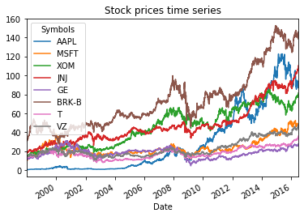
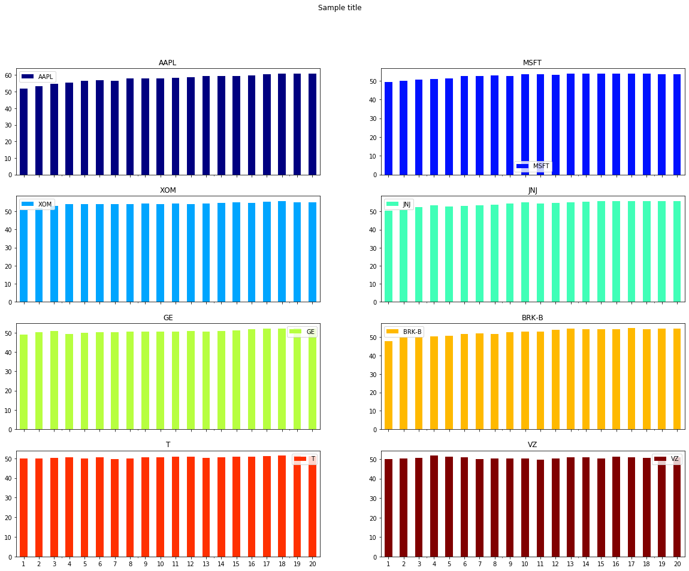
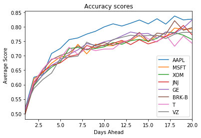
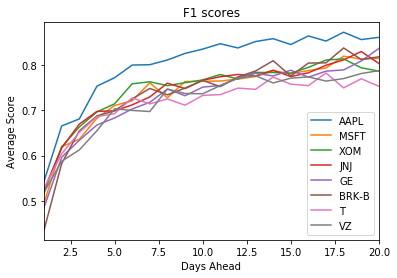

# Introduction

This code aims to evaluate stock market predictions using random forest algorithm. Here we try to replicate Khaidem et al paper with a few differences. Random forests differs from many other machine learning methods because it does not strictly need parameter tuning. Introduced by Breiman (2001), it is an aggregation of decisions trees. First, a bootstrapped sample is taken from the training set. Then, a number of random features are taken to form a decision tree. At last, each tree is trained and grow to the fullest possible extention without pruning. Those three steps are repeated n times in order to form random decision trees. Each tree gives a classification and the classification that has the higher number of votes is chosen. For the number of trees in the random forests. Since we will not be tuning the model’s parameters, we are only going to split the data to train and test set (no validation set). For the scores, Here, we used the accuracy score and the f1 score. 

$$F1 =2\frac { precision\times recall }{ precision+recall }$$  
$$precision=\frac { tp }{ tp+fp }$$
$$recall=\frac { tp }{ tp+fn }$$

where tp is the number of positive instances classifier as positive, fp is the number of negative instances classified as positive and fn is the number of positive instances classified as negative. Because of the randomness of the model, each train set is trained 5 times and the average of the scores on the test set is the final score. All of the calculation were done by python’s scikit-learn library.


```python
import pandas as pd
import pandas_datareader.data as web
import datetime
import numpy as np
from talib.abstract import *
from sklearn.model_selection import train_test_split
from sklearn.ensemble import RandomForestClassifier
from sklearn.metrics import f1_score
from sklearn.metrics import roc_auc_score
from sklearn.metrics import roc_curve, auc
from sklearn.multiclass import OneVsRestClassifier
from scipy import interp
import cufflinks as cf
```

# Data
Data for all the stocks were collected from Yahoo finances using pandas datareader. The time series goes from  May 5th, 1998 to May 4th, 2015 and we predicted the movement from 1 to 20 days in the future.


```python
start = datetime.datetime(1998, 1, 1)
end = datetime.datetime(2016, 6, 30)
top_500 = ['AAPL', 'MSFT', 'XOM', 'JNJ', 'GE', 'BRK-B', 'T', 'VZ']
```


```python
f = web.DataReader(top_500, 'yahoo',start,end)
cleanData = f.ix[0:4655,'Adj Close']
stock_data = pd.DataFrame(cleanData)
stock_data
```


<div>
<style scoped>
    .dataframe tbody tr th:only-of-type {
        vertical-align: middle;
    }

    .dataframe tbody tr th {
        vertical-align: top;
    }

    .dataframe thead tr th {
        text-align: left;
    }

    .dataframe thead tr:last-of-type th {
        text-align: right;
    }
</style>
<table border="1" class="dataframe">
  <thead>
    <tr>
      <th>Attributes</th>
      <th colspan="8" halign="left">Adj Close</th>
      <th colspan="2" halign="left">Close</th>
      <th>...</th>
      <th colspan="2" halign="left">Open</th>
      <th colspan="8" halign="left">Volume</th>
    </tr>
    <tr>
      <th>Symbols</th>
      <th>AAPL</th>
      <th>MSFT</th>
      <th>XOM</th>
      <th>JNJ</th>
      <th>GE</th>
      <th>BRK-B</th>
      <th>T</th>
      <th>VZ</th>
      <th>AAPL</th>
      <th>MSFT</th>
      <th>...</th>
      <th>T</th>
      <th>VZ</th>
      <th>AAPL</th>
      <th>MSFT</th>
      <th>XOM</th>
      <th>JNJ</th>
      <th>GE</th>
      <th>BRK-B</th>
      <th>T</th>
      <th>VZ</th>
    </tr>
    <tr>
      <th>Date</th>
      <th></th>
      <th></th>
      <th></th>
      <th></th>
      <th></th>
      <th></th>
      <th></th>
      <th></th>
      <th></th>
      <th></th>
      <th></th>
      <th></th>
      <th></th>
      <th></th>
      <th></th>
      <th></th>
      <th></th>
      <th></th>
      <th></th>
      <th></th>
      <th></th>
    </tr>
  </thead>
  <tbody>
    <tr>
      <td>1998-01-02</td>
      <td>0.504969</td>
      <td>10.545034</td>
      <td>15.760149</td>
      <td>18.234844</td>
      <td>11.615955</td>
      <td>30.580000</td>
      <td>13.491593</td>
      <td>14.616565</td>
      <td>0.580357</td>
      <td>16.390625</td>
      <td>...</td>
      <td>37.000000</td>
      <td>41.593678</td>
      <td>179527600.0</td>
      <td>39748000.0</td>
      <td>5657200.0</td>
      <td>4656400.0</td>
      <td>9762700.0</td>
      <td>65000.0</td>
      <td>4363200.0</td>
      <td>3931200.0</td>
    </tr>
    <tr>
      <td>1998-01-05</td>
      <td>0.493316</td>
      <td>10.484719</td>
      <td>15.585035</td>
      <td>18.217323</td>
      <td>11.821985</td>
      <td>31.100000</td>
      <td>13.109009</td>
      <td>14.174552</td>
      <td>0.566964</td>
      <td>16.296875</td>
      <td>...</td>
      <td>37.000000</td>
      <td>40.638145</td>
      <td>162968400.0</td>
      <td>80377600.0</td>
      <td>8728400.0</td>
      <td>5308200.0</td>
      <td>17606700.0</td>
      <td>320000.0</td>
      <td>5904400.0</td>
      <td>3628700.0</td>
    </tr>
    <tr>
      <td>1998-01-06</td>
      <td>0.588483</td>
      <td>10.545034</td>
      <td>15.027866</td>
      <td>17.937063</td>
      <td>11.665018</td>
      <td>31.180000</td>
      <td>13.052757</td>
      <td>14.516106</td>
      <td>0.676339</td>
      <td>16.390625</td>
      <td>...</td>
      <td>36.281250</td>
      <td>39.682617</td>
      <td>453118400.0</td>
      <td>67834400.0</td>
      <td>9009200.0</td>
      <td>4971400.0</td>
      <td>12856800.0</td>
      <td>300000.0</td>
      <td>5815800.0</td>
      <td>4532400.0</td>
    </tr>
    <tr>
      <td>1998-01-07</td>
      <td>0.543813</td>
      <td>10.419375</td>
      <td>15.505444</td>
      <td>18.112230</td>
      <td>11.763124</td>
      <td>31.459999</td>
      <td>13.213163</td>
      <td>14.499701</td>
      <td>0.625000</td>
      <td>16.195312</td>
      <td>...</td>
      <td>36.093750</td>
      <td>40.272797</td>
      <td>260405600.0</td>
      <td>61492800.0</td>
      <td>11663600.0</td>
      <td>3768200.0</td>
      <td>10416100.0</td>
      <td>175000.0</td>
      <td>4038800.0</td>
      <td>3831600.0</td>
    </tr>
    <tr>
      <td>1998-01-08</td>
      <td>0.565177</td>
      <td>10.494770</td>
      <td>15.171139</td>
      <td>18.322433</td>
      <td>11.655203</td>
      <td>31.799999</td>
      <td>13.088620</td>
      <td>14.294907</td>
      <td>0.649554</td>
      <td>16.312500</td>
      <td>...</td>
      <td>36.000000</td>
      <td>39.795033</td>
      <td>193505200.0</td>
      <td>77619200.0</td>
      <td>6357600.0</td>
      <td>6087800.0</td>
      <td>11953300.0</td>
      <td>165000.0</td>
      <td>3694000.0</td>
      <td>4006200.0</td>
    </tr>
    <tr>
      <td>...</td>
      <td>...</td>
      <td>...</td>
      <td>...</td>
      <td>...</td>
      <td>...</td>
      <td>...</td>
      <td>...</td>
      <td>...</td>
      <td>...</td>
      <td>...</td>
      <td>...</td>
      <td>...</td>
      <td>...</td>
      <td>...</td>
      <td>...</td>
      <td>...</td>
      <td>...</td>
      <td>...</td>
      <td>...</td>
      <td>...</td>
      <td>...</td>
    </tr>
    <tr>
      <td>2016-06-27</td>
      <td>87.002052</td>
      <td>45.297375</td>
      <td>77.092430</td>
      <td>106.120209</td>
      <td>25.553814</td>
      <td>138.500000</td>
      <td>34.737186</td>
      <td>46.805599</td>
      <td>92.040001</td>
      <td>48.430000</td>
      <td>...</td>
      <td>41.290001</td>
      <td>54.060001</td>
      <td>45489600.0</td>
      <td>50216300.0</td>
      <td>14169400.0</td>
      <td>10877400.0</td>
      <td>56201700.0</td>
      <td>6328200.0</td>
      <td>37455400.0</td>
      <td>22570200.0</td>
    </tr>
    <tr>
      <td>2016-06-28</td>
      <td>88.467209</td>
      <td>46.242058</td>
      <td>78.870972</td>
      <td>107.649872</td>
      <td>26.094175</td>
      <td>140.279999</td>
      <td>34.728924</td>
      <td>46.874004</td>
      <td>93.589996</td>
      <td>49.439999</td>
      <td>...</td>
      <td>42.139999</td>
      <td>54.759998</td>
      <td>40444900.0</td>
      <td>38140700.0</td>
      <td>13254300.0</td>
      <td>10089600.0</td>
      <td>39736800.0</td>
      <td>5312300.0</td>
      <td>34419000.0</td>
      <td>17780600.0</td>
    </tr>
    <tr>
      <td>2016-06-29</td>
      <td>89.232864</td>
      <td>47.270897</td>
      <td>80.215683</td>
      <td>108.651436</td>
      <td>26.625816</td>
      <td>142.119995</td>
      <td>35.158691</td>
      <td>47.079216</td>
      <td>94.400002</td>
      <td>50.540001</td>
      <td>...</td>
      <td>42.220001</td>
      <td>54.820000</td>
      <td>36531000.0</td>
      <td>31304000.0</td>
      <td>13920600.0</td>
      <td>8341500.0</td>
      <td>37302900.0</td>
      <td>4257100.0</td>
      <td>23671500.0</td>
      <td>18184100.0</td>
    </tr>
    <tr>
      <td>2016-06-30</td>
      <td>90.367195</td>
      <td>47.860149</td>
      <td>81.326195</td>
      <td>110.445160</td>
      <td>27.436356</td>
      <td>144.789993</td>
      <td>35.712440</td>
      <td>47.746155</td>
      <td>95.599998</td>
      <td>51.169998</td>
      <td>...</td>
      <td>42.689999</td>
      <td>55.270000</td>
      <td>35836400.0</td>
      <td>28527800.0</td>
      <td>14073700.0</td>
      <td>11559900.0</td>
      <td>56695000.0</td>
      <td>5196400.0</td>
      <td>31913400.0</td>
      <td>22143300.0</td>
    </tr>
    <tr>
      <td>2016-07-01</td>
      <td>90.641319</td>
      <td>47.850803</td>
      <td>81.412933</td>
      <td>110.436050</td>
      <td>27.445074</td>
      <td>143.960007</td>
      <td>35.927326</td>
      <td>48.079624</td>
      <td>95.889999</td>
      <td>51.160000</td>
      <td>...</td>
      <td>43.209999</td>
      <td>55.849998</td>
      <td>26026500.0</td>
      <td>21400400.0</td>
      <td>9946300.0</td>
      <td>7051400.0</td>
      <td>34008300.0</td>
      <td>2874400.0</td>
      <td>23237300.0</td>
      <td>16092300.0</td>
    </tr>
  </tbody>
</table>
<p>4655 rows × 48 columns</p>
</div>


## Data visualization
Here we can see the time series plot for all the 8 companies stocks movements.


```python
# Import the plotting library
import matplotlib.pyplot as plt
%matplotlib inline
# Plot the close prices
stock_data.plot()
plt.title('Stock prices time series')
plt.show()

```





```python
stocks = {}
for i in top_500:
    stocks[i] = web.DataReader(i, 'yahoo',start,end)
```


```python
for i,j in enumerate(stocks):
    stocks[j].columns = [s.lower() for s in stocks[j].columns]
    stocks[j].volume = stocks[j].volume.apply(lambda x: float(x))
```

## Technical indicators
The technical indicators were calculated with default parameters settings using TA-Lib python package. They are summarized in the table below where Pt is the closing price at the day t, Ht is the high price at day t, Lt is the low price at day t, HHn is the highest high during the last n days, LLt is the lowest low during the last n days, and EMA(n) is the exponential moving average. 


```python
def get_indicators(stocks, period):
    stocks_indicators = {}
    for i in stocks:
        features = pd.DataFrame(SMA(stocks[i], timeperiod=5))
        features.columns = ['sma_5']
        features['sma_10'] = pd.DataFrame(SMA(stocks[i], timeperiod=10))
        features['mom_10'] = pd.DataFrame(MOM(stocks[i],10))
        features['wma_10'] = pd.DataFrame(WMA(stocks[i],10))
        features['wma_5'] = pd.DataFrame(WMA(stocks[i],5))
        features = pd.concat([features,STOCHF(stocks[i], 
                                          fastk_period=14, 
                                          fastd_period=3)],
                             axis=1)
        features['macd'] = pd.DataFrame(MACD(stocks[i], fastperiod=12, slowperiod=26)['macd'])
        features['rsi'] = pd.DataFrame(RSI(stocks[i], timeperiod=14))
        features['willr'] = pd.DataFrame(WILLR(stocks[i], timeperiod=14))
        features['cci'] = pd.DataFrame(CCI(stocks[i], timeperiod=14))
        features['adosc'] = pd.DataFrame(ADOSC(stocks[i], fastperiod=3, slowperiod=10))
        features['pct_change'] = ROC(stocks[i], timeperiod=period)
        features['pct_change'] = features['pct_change'].shift(-period)
        features['pct_change'] = features['pct_change'].apply(lambda x: '1' if x > 0 else '0' if x <= 0 else np.nan)
        features = features.dropna()
        features = features.iloc[np.where(features.index=='1998-5-5')[0][0]:np.where(features.index=='2015-5-5')[0][0]]
        stocks_indicators[i] = features
    return stocks_indicators
```


```python
stocks_indicators = get_indicators(stocks, 1)
```


```python
stocks_indicators['AAPL'].head()
```


<div>
<style scoped>
    .dataframe tbody tr th:only-of-type {
        vertical-align: middle;
    }

    .dataframe tbody tr th {
        vertical-align: top;
    }

    .dataframe thead th {
        text-align: right;
    }
</style>
<table border="1" class="dataframe">
  <thead>
    <tr style="text-align: right;">
      <th></th>
      <th>sma_5</th>
      <th>sma_10</th>
      <th>mom_10</th>
      <th>wma_10</th>
      <th>wma_5</th>
      <th>fastk</th>
      <th>fastd</th>
      <th>macd</th>
      <th>rsi</th>
      <th>willr</th>
      <th>cci</th>
      <th>adosc</th>
      <th>pct_change</th>
    </tr>
    <tr>
      <th>Date</th>
      <th></th>
      <th></th>
      <th></th>
      <th></th>
      <th></th>
      <th></th>
      <th></th>
      <th></th>
      <th></th>
      <th></th>
      <th></th>
      <th></th>
      <th></th>
    </tr>
  </thead>
  <tbody>
    <tr>
      <td>1998-05-05</td>
      <td>1.008036</td>
      <td>0.996205</td>
      <td>0.024554</td>
      <td>1.005479</td>
      <td>1.024851</td>
      <td>94.827559</td>
      <td>76.670918</td>
      <td>0.024356</td>
      <td>65.507379</td>
      <td>-5.172441</td>
      <td>149.900739</td>
      <td>1.206611e+07</td>
      <td>1</td>
    </tr>
    <tr>
      <td>1998-05-06</td>
      <td>1.031696</td>
      <td>1.006250</td>
      <td>0.100446</td>
      <td>1.021185</td>
      <td>1.049702</td>
      <td>97.014936</td>
      <td>91.725282</td>
      <td>0.028952</td>
      <td>68.116586</td>
      <td>-2.985064</td>
      <td>159.423507</td>
      <td>7.128966e+07</td>
      <td>0</td>
    </tr>
    <tr>
      <td>1998-05-07</td>
      <td>1.051786</td>
      <td>1.015179</td>
      <td>0.089286</td>
      <td>1.034253</td>
      <td>1.065179</td>
      <td>90.000000</td>
      <td>93.947498</td>
      <td>0.031867</td>
      <td>67.024571</td>
      <td>-10.000000</td>
      <td>137.254909</td>
      <td>8.170652e+07</td>
      <td>1</td>
    </tr>
    <tr>
      <td>1998-05-08</td>
      <td>1.069196</td>
      <td>1.024107</td>
      <td>0.089286</td>
      <td>1.047321</td>
      <td>1.076935</td>
      <td>95.714264</td>
      <td>94.243067</td>
      <td>0.034500</td>
      <td>68.125193</td>
      <td>-4.285736</td>
      <td>116.666692</td>
      <td>9.529502e+07</td>
      <td>1</td>
    </tr>
    <tr>
      <td>1998-05-11</td>
      <td>1.082589</td>
      <td>1.035491</td>
      <td>0.113839</td>
      <td>1.062013</td>
      <td>1.088839</td>
      <td>87.209319</td>
      <td>90.974528</td>
      <td>0.037594</td>
      <td>70.262972</td>
      <td>-12.790681</td>
      <td>134.908508</td>
      <td>6.196259e+07</td>
      <td>0</td>
    </tr>
  </tbody>
</table>
</div>


```python
len(stocks_indicators['AAPL'])
```


    4277


### Investigating the data structure
Before proceeding with training the data, we had to check weather the data are balanced. The figure below shows the percentage of positive returns instances for each day and for each stock. Fortunately, the data does not need to be balanced since they are almost evenly split for all the stocks.


```python
def weighs_tabale(stocks, period):
    table = pd.DataFrame()
    for j in stocks:
        weighs_1 = []
        for i in range(1,period+1):
            stocks_indicators = get_indicators(stocks, i)
            weighs_1.append((len(stocks_indicators[j][stocks_indicators[j]['pct_change']=='1'])/\
                            float(len(stocks_indicators[j])))*100)
        table = pd.concat([table, pd.DataFrame(weighs_1)], axis=1)
    table.index = range(1,period+1)
    table.columns = stocks.keys()
    return table
```


```python
table = weighs_tabale(stocks, 20)
table
```


<div>
<style scoped>
    .dataframe tbody tr th:only-of-type {
        vertical-align: middle;
    }

    .dataframe tbody tr th {
        vertical-align: top;
    }

    .dataframe thead th {
        text-align: right;
    }
</style>
<table border="1" class="dataframe">
  <thead>
    <tr style="text-align: right;">
      <th></th>
      <th>AAPL</th>
      <th>MSFT</th>
      <th>XOM</th>
      <th>JNJ</th>
      <th>GE</th>
      <th>BRK-B</th>
      <th>T</th>
      <th>VZ</th>
    </tr>
  </thead>
  <tbody>
    <tr>
      <td>1</td>
      <td>51.905541</td>
      <td>49.357026</td>
      <td>50.736498</td>
      <td>50.479308</td>
      <td>48.912789</td>
      <td>47.813888</td>
      <td>49.941548</td>
      <td>49.918167</td>
    </tr>
    <tr>
      <td>2</td>
      <td>53.238251</td>
      <td>50.011690</td>
      <td>51.835399</td>
      <td>50.876783</td>
      <td>50.128595</td>
      <td>49.754501</td>
      <td>49.918167</td>
      <td>50.268880</td>
    </tr>
    <tr>
      <td>3</td>
      <td>54.570961</td>
      <td>50.549451</td>
      <td>52.864157</td>
      <td>52.419921</td>
      <td>50.853402</td>
      <td>50.198737</td>
      <td>50.385784</td>
      <td>50.713117</td>
    </tr>
    <tr>
      <td>4</td>
      <td>55.552958</td>
      <td>50.853402</td>
      <td>53.986439</td>
      <td>53.565583</td>
      <td>49.427169</td>
      <td>50.292261</td>
      <td>50.526070</td>
      <td>51.882160</td>
    </tr>
    <tr>
      <td>5</td>
      <td>56.418050</td>
      <td>51.274258</td>
      <td>53.916296</td>
      <td>52.653729</td>
      <td>49.894786</td>
      <td>50.830021</td>
      <td>49.941548</td>
      <td>51.391162</td>
    </tr>
    <tr>
      <td>6</td>
      <td>56.792144</td>
      <td>52.349778</td>
      <td>53.986439</td>
      <td>53.214870</td>
      <td>50.128595</td>
      <td>51.812018</td>
      <td>50.455927</td>
      <td>51.040449</td>
    </tr>
    <tr>
      <td>7</td>
      <td>56.441431</td>
      <td>52.536825</td>
      <td>54.056582</td>
      <td>53.565583</td>
      <td>50.292261</td>
      <td>52.045827</td>
      <td>49.731120</td>
      <td>49.988310</td>
    </tr>
    <tr>
      <td>8</td>
      <td>57.820903</td>
      <td>52.910919</td>
      <td>54.103343</td>
      <td>53.776011</td>
      <td>50.619593</td>
      <td>51.765256</td>
      <td>50.011690</td>
      <td>50.292261</td>
    </tr>
    <tr>
      <td>9</td>
      <td>57.984569</td>
      <td>52.443301</td>
      <td>54.243629</td>
      <td>54.337152</td>
      <td>50.502689</td>
      <td>52.630348</td>
      <td>50.479308</td>
      <td>50.222118</td>
    </tr>
    <tr>
      <td>10</td>
      <td>57.867664</td>
      <td>53.401917</td>
      <td>54.056582</td>
      <td>54.945055</td>
      <td>50.549451</td>
      <td>52.981061</td>
      <td>50.642974</td>
      <td>50.198737</td>
    </tr>
    <tr>
      <td>11</td>
      <td>58.475567</td>
      <td>53.472060</td>
      <td>54.454057</td>
      <td>54.407295</td>
      <td>50.713117</td>
      <td>52.910919</td>
      <td>50.946925</td>
      <td>49.824643</td>
    </tr>
    <tr>
      <td>12</td>
      <td>58.685995</td>
      <td>53.004442</td>
      <td>54.033201</td>
      <td>54.898293</td>
      <td>50.923545</td>
      <td>53.986439</td>
      <td>50.830021</td>
      <td>50.455927</td>
    </tr>
    <tr>
      <td>13</td>
      <td>59.457564</td>
      <td>53.799392</td>
      <td>54.477437</td>
      <td>55.038578</td>
      <td>50.572831</td>
      <td>54.477437</td>
      <td>50.198737</td>
      <td>50.830021</td>
    </tr>
    <tr>
      <td>14</td>
      <td>59.410802</td>
      <td>53.822773</td>
      <td>54.758008</td>
      <td>55.272387</td>
      <td>50.806640</td>
      <td>54.196867</td>
      <td>50.666355</td>
      <td>50.876783</td>
    </tr>
    <tr>
      <td>15</td>
      <td>59.574468</td>
      <td>53.705869</td>
      <td>55.085340</td>
      <td>55.716624</td>
      <td>51.063830</td>
      <td>54.454057</td>
      <td>50.806640</td>
      <td>50.479308</td>
    </tr>
    <tr>
      <td>16</td>
      <td>59.808277</td>
      <td>53.752630</td>
      <td>54.828151</td>
      <td>55.693243</td>
      <td>51.718494</td>
      <td>54.383914</td>
      <td>50.783259</td>
      <td>51.180734</td>
    </tr>
    <tr>
      <td>17</td>
      <td>60.509703</td>
      <td>53.776011</td>
      <td>55.272387</td>
      <td>55.646481</td>
      <td>52.092588</td>
      <td>54.874912</td>
      <td>51.227496</td>
      <td>50.830021</td>
    </tr>
    <tr>
      <td>18</td>
      <td>60.696750</td>
      <td>53.705869</td>
      <td>55.810147</td>
      <td>55.693243</td>
      <td>52.022446</td>
      <td>54.173486</td>
      <td>51.367781</td>
      <td>50.619593</td>
    </tr>
    <tr>
      <td>19</td>
      <td>60.907178</td>
      <td>53.565583</td>
      <td>54.921674</td>
      <td>55.599719</td>
      <td>52.349778</td>
      <td>54.641104</td>
      <td>51.461305</td>
      <td>50.900164</td>
    </tr>
    <tr>
      <td>20</td>
      <td>60.907178</td>
      <td>53.401917</td>
      <td>55.108721</td>
      <td>55.880290</td>
      <td>52.209493</td>
      <td>54.594342</td>
      <td>51.250877</td>
      <td>50.993687</td>
    </tr>
  </tbody>
</table>
</div>


```python
axes = table.plot(kind='bar',rot=0,lw=2,colormap='jet',figsize=(20,15),
             title='Sample title', subplots=True, layout=(4,2))
```





# Results


```python
def avg_score(x_train, y_train,x_test,y_test,trees):
    accuracy = []
    f1 = []
    rf_model = RandomForestClassifier(trees)
    for i in range(5):
        rf_model.fit(x_train,y_train)
        accuracy.append(rf_model.score(x_test,y_test))
        f1.append(f1_score(y_test,rf_model.predict(x_test), pos_label='1'))
    avg_accuracy = sum(accuracy)/len(accuracy)
    avg_f1 = sum(f1)/len(f1)
    prob = rf_model.predict_proba(x_test)
    return avg_accuracy, avg_f1, prob
```


```python
def accuracy(stocks, trees, period):
    table_accuracy = pd.DataFrame()
    table_f1 = pd.DataFrame()
    for j in stocks:
        accuracy_values = []
        f1_values = []
        for i in range(1,period+1):
            stocks_indicators = get_indicators(stocks, i)
            train, test = train_test_split(stocks_indicators[j])
            accuracy, f1, prob = avg_score(train.iloc[:,:-1],train.iloc[:,-1],test.iloc[:,:-1],test.iloc[:,-1],trees)
            accuracy_values.append(accuracy)
            f1_values.append(f1)
        table_accuracy = pd.concat([table_accuracy, pd.DataFrame({j : accuracy_values})], axis=1)
        table_f1 = pd.concat([table_f1, pd.DataFrame({j : f1_values})], axis=1)
    table_accuracy.index = range(1,period+1)
    table_f1.index = range(1,period+1)
    return table_accuracy, table_f1, prob
```


```python
accuracy_table, f1_table, prob = accuracy(stocks, 300, 20)
```


```python
accuracy_table.plot()
plt.title('Accuracy scores')
plt.xlabel('Days Ahead')
plt.ylabel('Average Score')
plt.show()
```





```python
f1_table.plot()
plt.title('F1 scores')
plt.xlabel('Days Ahead')
plt.ylabel('Average Score')
plt.show()
```





```python
def highlight_max(s):
    '''
    highlight the maximum in a Series yellow.
    '''
    is_max = s == s.max()
    return ['background-color: yellow' if v else '' for v in is_max]
```


```python
accuracy_table.style.apply(highlight_max, axis=0)
```


<style  type="text/css" >
    #T_e04ad550_1cf9_11ea_9b82_5cc9d355d84brow13_col6 {
            background-color:  yellow;
        }    #T_e04ad550_1cf9_11ea_9b82_5cc9d355d84brow16_col2 {
            background-color:  yellow;
        }    #T_e04ad550_1cf9_11ea_9b82_5cc9d355d84brow17_col0 {
            background-color:  yellow;
        }    #T_e04ad550_1cf9_11ea_9b82_5cc9d355d84brow17_col1 {
            background-color:  yellow;
        }    #T_e04ad550_1cf9_11ea_9b82_5cc9d355d84brow17_col5 {
            background-color:  yellow;
        }    #T_e04ad550_1cf9_11ea_9b82_5cc9d355d84brow18_col3 {
            background-color:  yellow;
        }    #T_e04ad550_1cf9_11ea_9b82_5cc9d355d84brow18_col7 {
            background-color:  yellow;
        }    #T_e04ad550_1cf9_11ea_9b82_5cc9d355d84brow19_col4 {
            background-color:  yellow;
        }</style><table id="T_e04ad550_1cf9_11ea_9b82_5cc9d355d84b" ><thead>    <tr>        <th class="blank level0" ></th>        <th class="col_heading level0 col0" >AAPL</th>        <th class="col_heading level0 col1" >MSFT</th>        <th class="col_heading level0 col2" >XOM</th>        <th class="col_heading level0 col3" >JNJ</th>        <th class="col_heading level0 col4" >GE</th>        <th class="col_heading level0 col5" >BRK-B</th>        <th class="col_heading level0 col6" >T</th>        <th class="col_heading level0 col7" >VZ</th>    </tr></thead><tbody>
                <tr>
                        <th id="T_e04ad550_1cf9_11ea_9b82_5cc9d355d84blevel0_row0" class="row_heading level0 row0" >1</th>
                        <td id="T_e04ad550_1cf9_11ea_9b82_5cc9d355d84brow0_col0" class="data row0 col0" >0.517944</td>
                        <td id="T_e04ad550_1cf9_11ea_9b82_5cc9d355d84brow0_col1" class="data row0 col1" >0.501869</td>
                        <td id="T_e04ad550_1cf9_11ea_9b82_5cc9d355d84brow0_col2" class="data row0 col2" >0.513458</td>
                        <td id="T_e04ad550_1cf9_11ea_9b82_5cc9d355d84brow0_col3" class="data row0 col3" >0.497944</td>
                        <td id="T_e04ad550_1cf9_11ea_9b82_5cc9d355d84brow0_col4" class="data row0 col4" >0.511215</td>
                        <td id="T_e04ad550_1cf9_11ea_9b82_5cc9d355d84brow0_col5" class="data row0 col5" >0.498131</td>
                        <td id="T_e04ad550_1cf9_11ea_9b82_5cc9d355d84brow0_col6" class="data row0 col6" >0.517196</td>
                        <td id="T_e04ad550_1cf9_11ea_9b82_5cc9d355d84brow0_col7" class="data row0 col7" >0.523925</td>
            </tr>
            <tr>
                        <th id="T_e04ad550_1cf9_11ea_9b82_5cc9d355d84blevel0_row1" class="row_heading level0 row1" >2</th>
                        <td id="T_e04ad550_1cf9_11ea_9b82_5cc9d355d84brow1_col0" class="data row1 col0" >0.625607</td>
                        <td id="T_e04ad550_1cf9_11ea_9b82_5cc9d355d84brow1_col1" class="data row1 col1" >0.620374</td>
                        <td id="T_e04ad550_1cf9_11ea_9b82_5cc9d355d84brow1_col2" class="data row1 col2" >0.596262</td>
                        <td id="T_e04ad550_1cf9_11ea_9b82_5cc9d355d84brow1_col3" class="data row1 col3" >0.606542</td>
                        <td id="T_e04ad550_1cf9_11ea_9b82_5cc9d355d84brow1_col4" class="data row1 col4" >0.599813</td>
                        <td id="T_e04ad550_1cf9_11ea_9b82_5cc9d355d84brow1_col5" class="data row1 col5" >0.597944</td>
                        <td id="T_e04ad550_1cf9_11ea_9b82_5cc9d355d84brow1_col6" class="data row1 col6" >0.610093</td>
                        <td id="T_e04ad550_1cf9_11ea_9b82_5cc9d355d84brow1_col7" class="data row1 col7" >0.586916</td>
            </tr>
            <tr>
                        <th id="T_e04ad550_1cf9_11ea_9b82_5cc9d355d84blevel0_row2" class="row_heading level0 row2" >3</th>
                        <td id="T_e04ad550_1cf9_11ea_9b82_5cc9d355d84brow2_col0" class="data row2 col0" >0.634766</td>
                        <td id="T_e04ad550_1cf9_11ea_9b82_5cc9d355d84brow2_col1" class="data row2 col1" >0.640748</td>
                        <td id="T_e04ad550_1cf9_11ea_9b82_5cc9d355d84brow2_col2" class="data row2 col2" >0.633271</td>
                        <td id="T_e04ad550_1cf9_11ea_9b82_5cc9d355d84brow2_col3" class="data row2 col3" >0.64486</td>
                        <td id="T_e04ad550_1cf9_11ea_9b82_5cc9d355d84brow2_col4" class="data row2 col4" >0.633084</td>
                        <td id="T_e04ad550_1cf9_11ea_9b82_5cc9d355d84brow2_col5" class="data row2 col5" >0.650841</td>
                        <td id="T_e04ad550_1cf9_11ea_9b82_5cc9d355d84brow2_col6" class="data row2 col6" >0.653832</td>
                        <td id="T_e04ad550_1cf9_11ea_9b82_5cc9d355d84brow2_col7" class="data row2 col7" >0.617383</td>
            </tr>
            <tr>
                        <th id="T_e04ad550_1cf9_11ea_9b82_5cc9d355d84blevel0_row3" class="row_heading level0 row3" >4</th>
                        <td id="T_e04ad550_1cf9_11ea_9b82_5cc9d355d84brow3_col0" class="data row3 col0" >0.707664</td>
                        <td id="T_e04ad550_1cf9_11ea_9b82_5cc9d355d84brow3_col1" class="data row3 col1" >0.674019</td>
                        <td id="T_e04ad550_1cf9_11ea_9b82_5cc9d355d84brow3_col2" class="data row3 col2" >0.660374</td>
                        <td id="T_e04ad550_1cf9_11ea_9b82_5cc9d355d84brow3_col3" class="data row3 col3" >0.666168</td>
                        <td id="T_e04ad550_1cf9_11ea_9b82_5cc9d355d84brow3_col4" class="data row3 col4" >0.666916</td>
                        <td id="T_e04ad550_1cf9_11ea_9b82_5cc9d355d84brow3_col5" class="data row3 col5" >0.686355</td>
                        <td id="T_e04ad550_1cf9_11ea_9b82_5cc9d355d84brow3_col6" class="data row3 col6" >0.688785</td>
                        <td id="T_e04ad550_1cf9_11ea_9b82_5cc9d355d84brow3_col7" class="data row3 col7" >0.64</td>
            </tr>
            <tr>
                        <th id="T_e04ad550_1cf9_11ea_9b82_5cc9d355d84blevel0_row4" class="row_heading level0 row4" >5</th>
                        <td id="T_e04ad550_1cf9_11ea_9b82_5cc9d355d84brow4_col0" class="data row4 col0" >0.725234</td>
                        <td id="T_e04ad550_1cf9_11ea_9b82_5cc9d355d84brow4_col1" class="data row4 col1" >0.696262</td>
                        <td id="T_e04ad550_1cf9_11ea_9b82_5cc9d355d84brow4_col2" class="data row4 col2" >0.678879</td>
                        <td id="T_e04ad550_1cf9_11ea_9b82_5cc9d355d84brow4_col3" class="data row4 col3" >0.675514</td>
                        <td id="T_e04ad550_1cf9_11ea_9b82_5cc9d355d84brow4_col4" class="data row4 col4" >0.684112</td>
                        <td id="T_e04ad550_1cf9_11ea_9b82_5cc9d355d84brow4_col5" class="data row4 col5" >0.701121</td>
                        <td id="T_e04ad550_1cf9_11ea_9b82_5cc9d355d84brow4_col6" class="data row4 col6" >0.69215</td>
                        <td id="T_e04ad550_1cf9_11ea_9b82_5cc9d355d84brow4_col7" class="data row4 col7" >0.690467</td>
            </tr>
            <tr>
                        <th id="T_e04ad550_1cf9_11ea_9b82_5cc9d355d84blevel0_row5" class="row_heading level0 row5" >6</th>
                        <td id="T_e04ad550_1cf9_11ea_9b82_5cc9d355d84brow5_col0" class="data row5 col0" >0.755888</td>
                        <td id="T_e04ad550_1cf9_11ea_9b82_5cc9d355d84brow5_col1" class="data row5 col1" >0.700935</td>
                        <td id="T_e04ad550_1cf9_11ea_9b82_5cc9d355d84brow5_col2" class="data row5 col2" >0.72486</td>
                        <td id="T_e04ad550_1cf9_11ea_9b82_5cc9d355d84brow5_col3" class="data row5 col3" >0.697383</td>
                        <td id="T_e04ad550_1cf9_11ea_9b82_5cc9d355d84brow5_col4" class="data row5 col4" >0.70486</td>
                        <td id="T_e04ad550_1cf9_11ea_9b82_5cc9d355d84brow5_col5" class="data row5 col5" >0.710467</td>
                        <td id="T_e04ad550_1cf9_11ea_9b82_5cc9d355d84brow5_col6" class="data row5 col6" >0.729533</td>
                        <td id="T_e04ad550_1cf9_11ea_9b82_5cc9d355d84brow5_col7" class="data row5 col7" >0.69514</td>
            </tr>
            <tr>
                        <th id="T_e04ad550_1cf9_11ea_9b82_5cc9d355d84blevel0_row6" class="row_heading level0 row6" >7</th>
                        <td id="T_e04ad550_1cf9_11ea_9b82_5cc9d355d84brow6_col0" class="data row6 col0" >0.761682</td>
                        <td id="T_e04ad550_1cf9_11ea_9b82_5cc9d355d84brow6_col1" class="data row6 col1" >0.739626</td>
                        <td id="T_e04ad550_1cf9_11ea_9b82_5cc9d355d84brow6_col2" class="data row6 col2" >0.728972</td>
                        <td id="T_e04ad550_1cf9_11ea_9b82_5cc9d355d84brow6_col3" class="data row6 col3" >0.704112</td>
                        <td id="T_e04ad550_1cf9_11ea_9b82_5cc9d355d84brow6_col4" class="data row6 col4" >0.720374</td>
                        <td id="T_e04ad550_1cf9_11ea_9b82_5cc9d355d84brow6_col5" class="data row6 col5" >0.733832</td>
                        <td id="T_e04ad550_1cf9_11ea_9b82_5cc9d355d84brow6_col6" class="data row6 col6" >0.70486</td>
                        <td id="T_e04ad550_1cf9_11ea_9b82_5cc9d355d84brow6_col7" class="data row6 col7" >0.698879</td>
            </tr>
            <tr>
                        <th id="T_e04ad550_1cf9_11ea_9b82_5cc9d355d84blevel0_row7" class="row_heading level0 row7" >8</th>
                        <td id="T_e04ad550_1cf9_11ea_9b82_5cc9d355d84brow7_col0" class="data row7 col0" >0.774953</td>
                        <td id="T_e04ad550_1cf9_11ea_9b82_5cc9d355d84brow7_col1" class="data row7 col1" >0.706542</td>
                        <td id="T_e04ad550_1cf9_11ea_9b82_5cc9d355d84brow7_col2" class="data row7 col2" >0.720561</td>
                        <td id="T_e04ad550_1cf9_11ea_9b82_5cc9d355d84brow7_col3" class="data row7 col3" >0.735327</td>
                        <td id="T_e04ad550_1cf9_11ea_9b82_5cc9d355d84brow7_col4" class="data row7 col4" >0.742056</td>
                        <td id="T_e04ad550_1cf9_11ea_9b82_5cc9d355d84brow7_col5" class="data row7 col5" >0.720561</td>
                        <td id="T_e04ad550_1cf9_11ea_9b82_5cc9d355d84brow7_col6" class="data row7 col6" >0.725607</td>
                        <td id="T_e04ad550_1cf9_11ea_9b82_5cc9d355d84brow7_col7" class="data row7 col7" >0.747103</td>
            </tr>
            <tr>
                        <th id="T_e04ad550_1cf9_11ea_9b82_5cc9d355d84blevel0_row8" class="row_heading level0 row8" >9</th>
                        <td id="T_e04ad550_1cf9_11ea_9b82_5cc9d355d84brow8_col0" class="data row8 col0" >0.784673</td>
                        <td id="T_e04ad550_1cf9_11ea_9b82_5cc9d355d84brow8_col1" class="data row8 col1" >0.74</td>
                        <td id="T_e04ad550_1cf9_11ea_9b82_5cc9d355d84brow8_col2" class="data row8 col2" >0.725234</td>
                        <td id="T_e04ad550_1cf9_11ea_9b82_5cc9d355d84brow8_col3" class="data row8 col3" >0.72729</td>
                        <td id="T_e04ad550_1cf9_11ea_9b82_5cc9d355d84brow8_col4" class="data row8 col4" >0.736449</td>
                        <td id="T_e04ad550_1cf9_11ea_9b82_5cc9d355d84brow8_col5" class="data row8 col5" >0.736262</td>
                        <td id="T_e04ad550_1cf9_11ea_9b82_5cc9d355d84brow8_col6" class="data row8 col6" >0.717757</td>
                        <td id="T_e04ad550_1cf9_11ea_9b82_5cc9d355d84brow8_col7" class="data row8 col7" >0.733084</td>
            </tr>
            <tr>
                        <th id="T_e04ad550_1cf9_11ea_9b82_5cc9d355d84blevel0_row9" class="row_heading level0 row9" >10</th>
                        <td id="T_e04ad550_1cf9_11ea_9b82_5cc9d355d84brow9_col0" class="data row9 col0" >0.8</td>
                        <td id="T_e04ad550_1cf9_11ea_9b82_5cc9d355d84brow9_col1" class="data row9 col1" >0.734206</td>
                        <td id="T_e04ad550_1cf9_11ea_9b82_5cc9d355d84brow9_col2" class="data row9 col2" >0.730841</td>
                        <td id="T_e04ad550_1cf9_11ea_9b82_5cc9d355d84brow9_col3" class="data row9 col3" >0.737757</td>
                        <td id="T_e04ad550_1cf9_11ea_9b82_5cc9d355d84brow9_col4" class="data row9 col4" >0.748411</td>
                        <td id="T_e04ad550_1cf9_11ea_9b82_5cc9d355d84brow9_col5" class="data row9 col5" >0.745421</td>
                        <td id="T_e04ad550_1cf9_11ea_9b82_5cc9d355d84brow9_col6" class="data row9 col6" >0.723178</td>
                        <td id="T_e04ad550_1cf9_11ea_9b82_5cc9d355d84brow9_col7" class="data row9 col7" >0.734766</td>
            </tr>
            <tr>
                        <th id="T_e04ad550_1cf9_11ea_9b82_5cc9d355d84blevel0_row10" class="row_heading level0 row10" >11</th>
                        <td id="T_e04ad550_1cf9_11ea_9b82_5cc9d355d84brow10_col0" class="data row10 col0" >0.810467</td>
                        <td id="T_e04ad550_1cf9_11ea_9b82_5cc9d355d84brow10_col1" class="data row10 col1" >0.73514</td>
                        <td id="T_e04ad550_1cf9_11ea_9b82_5cc9d355d84brow10_col2" class="data row10 col2" >0.745794</td>
                        <td id="T_e04ad550_1cf9_11ea_9b82_5cc9d355d84brow10_col3" class="data row10 col3" >0.742617</td>
                        <td id="T_e04ad550_1cf9_11ea_9b82_5cc9d355d84brow10_col4" class="data row10 col4" >0.754766</td>
                        <td id="T_e04ad550_1cf9_11ea_9b82_5cc9d355d84brow10_col5" class="data row10 col5" >0.736636</td>
                        <td id="T_e04ad550_1cf9_11ea_9b82_5cc9d355d84brow10_col6" class="data row10 col6" >0.723551</td>
                        <td id="T_e04ad550_1cf9_11ea_9b82_5cc9d355d84brow10_col7" class="data row10 col7" >0.756075</td>
            </tr>
            <tr>
                        <th id="T_e04ad550_1cf9_11ea_9b82_5cc9d355d84blevel0_row11" class="row_heading level0 row11" >12</th>
                        <td id="T_e04ad550_1cf9_11ea_9b82_5cc9d355d84brow11_col0" class="data row11 col0" >0.802804</td>
                        <td id="T_e04ad550_1cf9_11ea_9b82_5cc9d355d84brow11_col1" class="data row11 col1" >0.749346</td>
                        <td id="T_e04ad550_1cf9_11ea_9b82_5cc9d355d84brow11_col2" class="data row11 col2" >0.739626</td>
                        <td id="T_e04ad550_1cf9_11ea_9b82_5cc9d355d84brow11_col3" class="data row11 col3" >0.753084</td>
                        <td id="T_e04ad550_1cf9_11ea_9b82_5cc9d355d84brow11_col4" class="data row11 col4" >0.768598</td>
                        <td id="T_e04ad550_1cf9_11ea_9b82_5cc9d355d84brow11_col5" class="data row11 col5" >0.744486</td>
                        <td id="T_e04ad550_1cf9_11ea_9b82_5cc9d355d84brow11_col6" class="data row11 col6" >0.74729</td>
                        <td id="T_e04ad550_1cf9_11ea_9b82_5cc9d355d84brow11_col7" class="data row11 col7" >0.763738</td>
            </tr>
            <tr>
                        <th id="T_e04ad550_1cf9_11ea_9b82_5cc9d355d84blevel0_row12" class="row_heading level0 row12" >13</th>
                        <td id="T_e04ad550_1cf9_11ea_9b82_5cc9d355d84brow12_col0" class="data row12 col0" >0.81271</td>
                        <td id="T_e04ad550_1cf9_11ea_9b82_5cc9d355d84brow12_col1" class="data row12 col1" >0.75215</td>
                        <td id="T_e04ad550_1cf9_11ea_9b82_5cc9d355d84brow12_col2" class="data row12 col2" >0.752336</td>
                        <td id="T_e04ad550_1cf9_11ea_9b82_5cc9d355d84brow12_col3" class="data row12 col3" >0.738692</td>
                        <td id="T_e04ad550_1cf9_11ea_9b82_5cc9d355d84brow12_col4" class="data row12 col4" >0.782243</td>
                        <td id="T_e04ad550_1cf9_11ea_9b82_5cc9d355d84brow12_col5" class="data row12 col5" >0.756636</td>
                        <td id="T_e04ad550_1cf9_11ea_9b82_5cc9d355d84brow12_col6" class="data row12 col6" >0.754393</td>
                        <td id="T_e04ad550_1cf9_11ea_9b82_5cc9d355d84brow12_col7" class="data row12 col7" >0.771028</td>
            </tr>
            <tr>
                        <th id="T_e04ad550_1cf9_11ea_9b82_5cc9d355d84blevel0_row13" class="row_heading level0 row13" >14</th>
                        <td id="T_e04ad550_1cf9_11ea_9b82_5cc9d355d84brow13_col0" class="data row13 col0" >0.823738</td>
                        <td id="T_e04ad550_1cf9_11ea_9b82_5cc9d355d84brow13_col1" class="data row13 col1" >0.771028</td>
                        <td id="T_e04ad550_1cf9_11ea_9b82_5cc9d355d84brow13_col2" class="data row13 col2" >0.756636</td>
                        <td id="T_e04ad550_1cf9_11ea_9b82_5cc9d355d84brow13_col3" class="data row13 col3" >0.755514</td>
                        <td id="T_e04ad550_1cf9_11ea_9b82_5cc9d355d84brow13_col4" class="data row13 col4" >0.776075</td>
                        <td id="T_e04ad550_1cf9_11ea_9b82_5cc9d355d84brow13_col5" class="data row13 col5" >0.780935</td>
                        <td id="T_e04ad550_1cf9_11ea_9b82_5cc9d355d84brow13_col6" class="data row13 col6" >0.777944</td>
                        <td id="T_e04ad550_1cf9_11ea_9b82_5cc9d355d84brow13_col7" class="data row13 col7" >0.768037</td>
            </tr>
            <tr>
                        <th id="T_e04ad550_1cf9_11ea_9b82_5cc9d355d84blevel0_row14" class="row_heading level0 row14" >15</th>
                        <td id="T_e04ad550_1cf9_11ea_9b82_5cc9d355d84brow14_col0" class="data row14 col0" >0.810467</td>
                        <td id="T_e04ad550_1cf9_11ea_9b82_5cc9d355d84brow14_col1" class="data row14 col1" >0.748037</td>
                        <td id="T_e04ad550_1cf9_11ea_9b82_5cc9d355d84brow14_col2" class="data row14 col2" >0.750841</td>
                        <td id="T_e04ad550_1cf9_11ea_9b82_5cc9d355d84brow14_col3" class="data row14 col3" >0.740935</td>
                        <td id="T_e04ad550_1cf9_11ea_9b82_5cc9d355d84brow14_col4" class="data row14 col4" >0.777196</td>
                        <td id="T_e04ad550_1cf9_11ea_9b82_5cc9d355d84brow14_col5" class="data row14 col5" >0.750093</td>
                        <td id="T_e04ad550_1cf9_11ea_9b82_5cc9d355d84brow14_col6" class="data row14 col6" >0.758692</td>
                        <td id="T_e04ad550_1cf9_11ea_9b82_5cc9d355d84brow14_col7" class="data row14 col7" >0.770093</td>
            </tr>
            <tr>
                        <th id="T_e04ad550_1cf9_11ea_9b82_5cc9d355d84blevel0_row15" class="row_heading level0 row15" >16</th>
                        <td id="T_e04ad550_1cf9_11ea_9b82_5cc9d355d84brow15_col0" class="data row15 col0" >0.828037</td>
                        <td id="T_e04ad550_1cf9_11ea_9b82_5cc9d355d84brow15_col1" class="data row15 col1" >0.770093</td>
                        <td id="T_e04ad550_1cf9_11ea_9b82_5cc9d355d84brow15_col2" class="data row15 col2" >0.760187</td>
                        <td id="T_e04ad550_1cf9_11ea_9b82_5cc9d355d84brow15_col3" class="data row15 col3" >0.749907</td>
                        <td id="T_e04ad550_1cf9_11ea_9b82_5cc9d355d84brow15_col4" class="data row15 col4" >0.761495</td>
                        <td id="T_e04ad550_1cf9_11ea_9b82_5cc9d355d84brow15_col5" class="data row15 col5" >0.778505</td>
                        <td id="T_e04ad550_1cf9_11ea_9b82_5cc9d355d84brow15_col6" class="data row15 col6" >0.74785</td>
                        <td id="T_e04ad550_1cf9_11ea_9b82_5cc9d355d84brow15_col7" class="data row15 col7" >0.770467</td>
            </tr>
            <tr>
                        <th id="T_e04ad550_1cf9_11ea_9b82_5cc9d355d84blevel0_row16" class="row_heading level0 row16" >17</th>
                        <td id="T_e04ad550_1cf9_11ea_9b82_5cc9d355d84brow16_col0" class="data row16 col0" >0.809533</td>
                        <td id="T_e04ad550_1cf9_11ea_9b82_5cc9d355d84brow16_col1" class="data row16 col1" >0.76486</td>
                        <td id="T_e04ad550_1cf9_11ea_9b82_5cc9d355d84brow16_col2" class="data row16 col2" >0.781682</td>
                        <td id="T_e04ad550_1cf9_11ea_9b82_5cc9d355d84brow16_col3" class="data row16 col3" >0.76729</td>
                        <td id="T_e04ad550_1cf9_11ea_9b82_5cc9d355d84brow16_col4" class="data row16 col4" >0.782617</td>
                        <td id="T_e04ad550_1cf9_11ea_9b82_5cc9d355d84brow16_col5" class="data row16 col5" >0.774579</td>
                        <td id="T_e04ad550_1cf9_11ea_9b82_5cc9d355d84brow16_col6" class="data row16 col6" >0.772336</td>
                        <td id="T_e04ad550_1cf9_11ea_9b82_5cc9d355d84brow16_col7" class="data row16 col7" >0.759439</td>
            </tr>
            <tr>
                        <th id="T_e04ad550_1cf9_11ea_9b82_5cc9d355d84blevel0_row17" class="row_heading level0 row17" >18</th>
                        <td id="T_e04ad550_1cf9_11ea_9b82_5cc9d355d84brow17_col0" class="data row17 col0" >0.83757</td>
                        <td id="T_e04ad550_1cf9_11ea_9b82_5cc9d355d84brow17_col1" class="data row17 col1" >0.795888</td>
                        <td id="T_e04ad550_1cf9_11ea_9b82_5cc9d355d84brow17_col2" class="data row17 col2" >0.780187</td>
                        <td id="T_e04ad550_1cf9_11ea_9b82_5cc9d355d84brow17_col3" class="data row17 col3" >0.779439</td>
                        <td id="T_e04ad550_1cf9_11ea_9b82_5cc9d355d84brow17_col4" class="data row17 col4" >0.77757</td>
                        <td id="T_e04ad550_1cf9_11ea_9b82_5cc9d355d84brow17_col5" class="data row17 col5" >0.821308</td>
                        <td id="T_e04ad550_1cf9_11ea_9b82_5cc9d355d84brow17_col6" class="data row17 col6" >0.732897</td>
                        <td id="T_e04ad550_1cf9_11ea_9b82_5cc9d355d84brow17_col7" class="data row17 col7" >0.774579</td>
            </tr>
            <tr>
                        <th id="T_e04ad550_1cf9_11ea_9b82_5cc9d355d84blevel0_row18" class="row_heading level0 row18" >19</th>
                        <td id="T_e04ad550_1cf9_11ea_9b82_5cc9d355d84brow18_col0" class="data row18 col0" >0.824112</td>
                        <td id="T_e04ad550_1cf9_11ea_9b82_5cc9d355d84brow18_col1" class="data row18 col1" >0.791776</td>
                        <td id="T_e04ad550_1cf9_11ea_9b82_5cc9d355d84brow18_col2" class="data row18 col2" >0.771215</td>
                        <td id="T_e04ad550_1cf9_11ea_9b82_5cc9d355d84brow18_col3" class="data row18 col3" >0.80486</td>
                        <td id="T_e04ad550_1cf9_11ea_9b82_5cc9d355d84brow18_col4" class="data row18 col4" >0.796075</td>
                        <td id="T_e04ad550_1cf9_11ea_9b82_5cc9d355d84brow18_col5" class="data row18 col5" >0.788224</td>
                        <td id="T_e04ad550_1cf9_11ea_9b82_5cc9d355d84brow18_col6" class="data row18 col6" >0.768224</td>
                        <td id="T_e04ad550_1cf9_11ea_9b82_5cc9d355d84brow18_col7" class="data row18 col7" >0.780935</td>
            </tr>
            <tr>
                        <th id="T_e04ad550_1cf9_11ea_9b82_5cc9d355d84blevel0_row19" class="row_heading level0 row19" >20</th>
                        <td id="T_e04ad550_1cf9_11ea_9b82_5cc9d355d84brow19_col0" class="data row19 col0" >0.826916</td>
                        <td id="T_e04ad550_1cf9_11ea_9b82_5cc9d355d84brow19_col1" class="data row19 col1" >0.792523</td>
                        <td id="T_e04ad550_1cf9_11ea_9b82_5cc9d355d84brow19_col2" class="data row19 col2" >0.756262</td>
                        <td id="T_e04ad550_1cf9_11ea_9b82_5cc9d355d84brow19_col3" class="data row19 col3" >0.772336</td>
                        <td id="T_e04ad550_1cf9_11ea_9b82_5cc9d355d84brow19_col4" class="data row19 col4" >0.824112</td>
                        <td id="T_e04ad550_1cf9_11ea_9b82_5cc9d355d84brow19_col5" class="data row19 col5" >0.797383</td>
                        <td id="T_e04ad550_1cf9_11ea_9b82_5cc9d355d84brow19_col6" class="data row19 col6" >0.742991</td>
                        <td id="T_e04ad550_1cf9_11ea_9b82_5cc9d355d84brow19_col7" class="data row19 col7" >0.780935</td>
            </tr>
    </tbody></table>


```python
f1_table.style.apply(highlight_max, axis=0)
```


<style  type="text/css" >
    #T_e07167c0_1cf9_11ea_91ab_5cc9d355d84brow16_col6 {
            background-color:  yellow;
        }    #T_e07167c0_1cf9_11ea_91ab_5cc9d355d84brow17_col0 {
            background-color:  yellow;
        }    #T_e07167c0_1cf9_11ea_91ab_5cc9d355d84brow17_col1 {
            background-color:  yellow;
        }    #T_e07167c0_1cf9_11ea_91ab_5cc9d355d84brow17_col2 {
            background-color:  yellow;
        }    #T_e07167c0_1cf9_11ea_91ab_5cc9d355d84brow17_col5 {
            background-color:  yellow;
        }    #T_e07167c0_1cf9_11ea_91ab_5cc9d355d84brow18_col3 {
            background-color:  yellow;
        }    #T_e07167c0_1cf9_11ea_91ab_5cc9d355d84brow19_col4 {
            background-color:  yellow;
        }    #T_e07167c0_1cf9_11ea_91ab_5cc9d355d84brow19_col7 {
            background-color:  yellow;
        }</style><table id="T_e07167c0_1cf9_11ea_91ab_5cc9d355d84b" ><thead>    <tr>        <th class="blank level0" ></th>        <th class="col_heading level0 col0" >AAPL</th>        <th class="col_heading level0 col1" >MSFT</th>        <th class="col_heading level0 col2" >XOM</th>        <th class="col_heading level0 col3" >JNJ</th>        <th class="col_heading level0 col4" >GE</th>        <th class="col_heading level0 col5" >BRK-B</th>        <th class="col_heading level0 col6" >T</th>        <th class="col_heading level0 col7" >VZ</th>    </tr></thead><tbody>
                <tr>
                        <th id="T_e07167c0_1cf9_11ea_91ab_5cc9d355d84blevel0_row0" class="row_heading level0 row0" >1</th>
                        <td id="T_e07167c0_1cf9_11ea_91ab_5cc9d355d84brow0_col0" class="data row0 col0" >0.543446</td>
                        <td id="T_e07167c0_1cf9_11ea_91ab_5cc9d355d84brow0_col1" class="data row0 col1" >0.494772</td>
                        <td id="T_e07167c0_1cf9_11ea_91ab_5cc9d355d84brow0_col2" class="data row0 col2" >0.518189</td>
                        <td id="T_e07167c0_1cf9_11ea_91ab_5cc9d355d84brow0_col3" class="data row0 col3" >0.524761</td>
                        <td id="T_e07167c0_1cf9_11ea_91ab_5cc9d355d84brow0_col4" class="data row0 col4" >0.485324</td>
                        <td id="T_e07167c0_1cf9_11ea_91ab_5cc9d355d84brow0_col5" class="data row0 col5" >0.435532</td>
                        <td id="T_e07167c0_1cf9_11ea_91ab_5cc9d355d84brow0_col6" class="data row0 col6" >0.527691</td>
                        <td id="T_e07167c0_1cf9_11ea_91ab_5cc9d355d84brow0_col7" class="data row0 col7" >0.518811</td>
            </tr>
            <tr>
                        <th id="T_e07167c0_1cf9_11ea_91ab_5cc9d355d84blevel0_row1" class="row_heading level0 row1" >2</th>
                        <td id="T_e07167c0_1cf9_11ea_91ab_5cc9d355d84brow1_col0" class="data row1 col0" >0.665542</td>
                        <td id="T_e07167c0_1cf9_11ea_91ab_5cc9d355d84brow1_col1" class="data row1 col1" >0.619981</td>
                        <td id="T_e07167c0_1cf9_11ea_91ab_5cc9d355d84brow1_col2" class="data row1 col2" >0.619023</td>
                        <td id="T_e07167c0_1cf9_11ea_91ab_5cc9d355d84brow1_col3" class="data row1 col3" >0.617056</td>
                        <td id="T_e07167c0_1cf9_11ea_91ab_5cc9d355d84brow1_col4" class="data row1 col4" >0.59644</td>
                        <td id="T_e07167c0_1cf9_11ea_91ab_5cc9d355d84brow1_col5" class="data row1 col5" >0.582576</td>
                        <td id="T_e07167c0_1cf9_11ea_91ab_5cc9d355d84brow1_col6" class="data row1 col6" >0.604021</td>
                        <td id="T_e07167c0_1cf9_11ea_91ab_5cc9d355d84brow1_col7" class="data row1 col7" >0.587628</td>
            </tr>
            <tr>
                        <th id="T_e07167c0_1cf9_11ea_91ab_5cc9d355d84blevel0_row2" class="row_heading level0 row2" >3</th>
                        <td id="T_e07167c0_1cf9_11ea_91ab_5cc9d355d84brow2_col0" class="data row2 col0" >0.68114</td>
                        <td id="T_e07167c0_1cf9_11ea_91ab_5cc9d355d84brow2_col1" class="data row2 col1" >0.635991</td>
                        <td id="T_e07167c0_1cf9_11ea_91ab_5cc9d355d84brow2_col2" class="data row2 col2" >0.663457</td>
                        <td id="T_e07167c0_1cf9_11ea_91ab_5cc9d355d84brow2_col3" class="data row2 col3" >0.669596</td>
                        <td id="T_e07167c0_1cf9_11ea_91ab_5cc9d355d84brow2_col4" class="data row2 col4" >0.633835</td>
                        <td id="T_e07167c0_1cf9_11ea_91ab_5cc9d355d84brow2_col5" class="data row2 col5" >0.654574</td>
                        <td id="T_e07167c0_1cf9_11ea_91ab_5cc9d355d84brow2_col6" class="data row2 col6" >0.651342</td>
                        <td id="T_e07167c0_1cf9_11ea_91ab_5cc9d355d84brow2_col7" class="data row2 col7" >0.612514</td>
            </tr>
            <tr>
                        <th id="T_e07167c0_1cf9_11ea_91ab_5cc9d355d84blevel0_row3" class="row_heading level0 row3" >4</th>
                        <td id="T_e07167c0_1cf9_11ea_91ab_5cc9d355d84brow3_col0" class="data row3 col0" >0.753614</td>
                        <td id="T_e07167c0_1cf9_11ea_91ab_5cc9d355d84brow3_col1" class="data row3 col1" >0.682789</td>
                        <td id="T_e07167c0_1cf9_11ea_91ab_5cc9d355d84brow3_col2" class="data row3 col2" >0.696604</td>
                        <td id="T_e07167c0_1cf9_11ea_91ab_5cc9d355d84brow3_col3" class="data row3 col3" >0.697772</td>
                        <td id="T_e07167c0_1cf9_11ea_91ab_5cc9d355d84brow3_col4" class="data row3 col4" >0.667632</td>
                        <td id="T_e07167c0_1cf9_11ea_91ab_5cc9d355d84brow3_col5" class="data row3 col5" >0.687856</td>
                        <td id="T_e07167c0_1cf9_11ea_91ab_5cc9d355d84brow3_col6" class="data row3 col6" >0.686135</td>
                        <td id="T_e07167c0_1cf9_11ea_91ab_5cc9d355d84brow3_col7" class="data row3 col7" >0.655073</td>
            </tr>
            <tr>
                        <th id="T_e07167c0_1cf9_11ea_91ab_5cc9d355d84blevel0_row4" class="row_heading level0 row4" >5</th>
                        <td id="T_e07167c0_1cf9_11ea_91ab_5cc9d355d84brow4_col0" class="data row4 col0" >0.772229</td>
                        <td id="T_e07167c0_1cf9_11ea_91ab_5cc9d355d84brow4_col1" class="data row4 col1" >0.710792</td>
                        <td id="T_e07167c0_1cf9_11ea_91ab_5cc9d355d84brow4_col2" class="data row4 col2" >0.714514</td>
                        <td id="T_e07167c0_1cf9_11ea_91ab_5cc9d355d84brow4_col3" class="data row4 col3" >0.699036</td>
                        <td id="T_e07167c0_1cf9_11ea_91ab_5cc9d355d84brow4_col4" class="data row4 col4" >0.683162</td>
                        <td id="T_e07167c0_1cf9_11ea_91ab_5cc9d355d84brow4_col5" class="data row4 col5" >0.699025</td>
                        <td id="T_e07167c0_1cf9_11ea_91ab_5cc9d355d84brow4_col6" class="data row4 col6" >0.692891</td>
                        <td id="T_e07167c0_1cf9_11ea_91ab_5cc9d355d84brow4_col7" class="data row4 col7" >0.703434</td>
            </tr>
            <tr>
                        <th id="T_e07167c0_1cf9_11ea_91ab_5cc9d355d84blevel0_row5" class="row_heading level0 row5" >6</th>
                        <td id="T_e07167c0_1cf9_11ea_91ab_5cc9d355d84brow5_col0" class="data row5 col0" >0.800305</td>
                        <td id="T_e07167c0_1cf9_11ea_91ab_5cc9d355d84brow5_col1" class="data row5 col1" >0.721358</td>
                        <td id="T_e07167c0_1cf9_11ea_91ab_5cc9d355d84brow5_col2" class="data row5 col2" >0.758846</td>
                        <td id="T_e07167c0_1cf9_11ea_91ab_5cc9d355d84brow5_col3" class="data row5 col3" >0.712153</td>
                        <td id="T_e07167c0_1cf9_11ea_91ab_5cc9d355d84brow5_col4" class="data row5 col4" >0.703149</td>
                        <td id="T_e07167c0_1cf9_11ea_91ab_5cc9d355d84brow5_col5" class="data row5 col5" >0.725385</td>
                        <td id="T_e07167c0_1cf9_11ea_91ab_5cc9d355d84brow5_col6" class="data row5 col6" >0.727635</td>
                        <td id="T_e07167c0_1cf9_11ea_91ab_5cc9d355d84brow5_col7" class="data row5 col7" >0.699907</td>
            </tr>
            <tr>
                        <th id="T_e07167c0_1cf9_11ea_91ab_5cc9d355d84blevel0_row6" class="row_heading level0 row6" >7</th>
                        <td id="T_e07167c0_1cf9_11ea_91ab_5cc9d355d84brow6_col0" class="data row6 col0" >0.801058</td>
                        <td id="T_e07167c0_1cf9_11ea_91ab_5cc9d355d84brow6_col1" class="data row6 col1" >0.760938</td>
                        <td id="T_e07167c0_1cf9_11ea_91ab_5cc9d355d84brow6_col2" class="data row6 col2" >0.763294</td>
                        <td id="T_e07167c0_1cf9_11ea_91ab_5cc9d355d84brow6_col3" class="data row6 col3" >0.729804</td>
                        <td id="T_e07167c0_1cf9_11ea_91ab_5cc9d355d84brow6_col4" class="data row6 col4" >0.717832</td>
                        <td id="T_e07167c0_1cf9_11ea_91ab_5cc9d355d84brow6_col5" class="data row6 col5" >0.748486</td>
                        <td id="T_e07167c0_1cf9_11ea_91ab_5cc9d355d84brow6_col6" class="data row6 col6" >0.714386</td>
                        <td id="T_e07167c0_1cf9_11ea_91ab_5cc9d355d84brow6_col7" class="data row6 col7" >0.697465</td>
            </tr>
            <tr>
                        <th id="T_e07167c0_1cf9_11ea_91ab_5cc9d355d84blevel0_row7" class="row_heading level0 row7" >8</th>
                        <td id="T_e07167c0_1cf9_11ea_91ab_5cc9d355d84brow7_col0" class="data row7 col0" >0.811527</td>
                        <td id="T_e07167c0_1cf9_11ea_91ab_5cc9d355d84brow7_col1" class="data row7 col1" >0.727996</td>
                        <td id="T_e07167c0_1cf9_11ea_91ab_5cc9d355d84brow7_col2" class="data row7 col2" >0.754704</td>
                        <td id="T_e07167c0_1cf9_11ea_91ab_5cc9d355d84brow7_col3" class="data row7 col3" >0.760242</td>
                        <td id="T_e07167c0_1cf9_11ea_91ab_5cc9d355d84brow7_col4" class="data row7 col4" >0.747171</td>
                        <td id="T_e07167c0_1cf9_11ea_91ab_5cc9d355d84brow7_col5" class="data row7 col5" >0.734499</td>
                        <td id="T_e07167c0_1cf9_11ea_91ab_5cc9d355d84brow7_col6" class="data row7 col6" >0.725293</td>
                        <td id="T_e07167c0_1cf9_11ea_91ab_5cc9d355d84brow7_col7" class="data row7 col7" >0.74725</td>
            </tr>
            <tr>
                        <th id="T_e07167c0_1cf9_11ea_91ab_5cc9d355d84blevel0_row8" class="row_heading level0 row8" >9</th>
                        <td id="T_e07167c0_1cf9_11ea_91ab_5cc9d355d84brow8_col0" class="data row8 col0" >0.826088</td>
                        <td id="T_e07167c0_1cf9_11ea_91ab_5cc9d355d84brow8_col1" class="data row8 col1" >0.763872</td>
                        <td id="T_e07167c0_1cf9_11ea_91ab_5cc9d355d84brow8_col2" class="data row8 col2" >0.76128</td>
                        <td id="T_e07167c0_1cf9_11ea_91ab_5cc9d355d84brow8_col3" class="data row8 col3" >0.748224</td>
                        <td id="T_e07167c0_1cf9_11ea_91ab_5cc9d355d84brow8_col4" class="data row8 col4" >0.732442</td>
                        <td id="T_e07167c0_1cf9_11ea_91ab_5cc9d355d84brow8_col5" class="data row8 col5" >0.749343</td>
                        <td id="T_e07167c0_1cf9_11ea_91ab_5cc9d355d84brow8_col6" class="data row8 col6" >0.711501</td>
                        <td id="T_e07167c0_1cf9_11ea_91ab_5cc9d355d84brow8_col7" class="data row8 col7" >0.737331</td>
            </tr>
            <tr>
                        <th id="T_e07167c0_1cf9_11ea_91ab_5cc9d355d84blevel0_row9" class="row_heading level0 row9" >10</th>
                        <td id="T_e07167c0_1cf9_11ea_91ab_5cc9d355d84brow9_col0" class="data row9 col0" >0.835543</td>
                        <td id="T_e07167c0_1cf9_11ea_91ab_5cc9d355d84brow9_col1" class="data row9 col1" >0.76433</td>
                        <td id="T_e07167c0_1cf9_11ea_91ab_5cc9d355d84brow9_col2" class="data row9 col2" >0.767355</td>
                        <td id="T_e07167c0_1cf9_11ea_91ab_5cc9d355d84brow9_col3" class="data row9 col3" >0.76659</td>
                        <td id="T_e07167c0_1cf9_11ea_91ab_5cc9d355d84brow9_col4" class="data row9 col4" >0.751376</td>
                        <td id="T_e07167c0_1cf9_11ea_91ab_5cc9d355d84brow9_col5" class="data row9 col5" >0.766366</td>
                        <td id="T_e07167c0_1cf9_11ea_91ab_5cc9d355d84brow9_col6" class="data row9 col6" >0.733116</td>
                        <td id="T_e07167c0_1cf9_11ea_91ab_5cc9d355d84brow9_col7" class="data row9 col7" >0.73678</td>
            </tr>
            <tr>
                        <th id="T_e07167c0_1cf9_11ea_91ab_5cc9d355d84blevel0_row10" class="row_heading level0 row10" >11</th>
                        <td id="T_e07167c0_1cf9_11ea_91ab_5cc9d355d84brow10_col0" class="data row10 col0" >0.84752</td>
                        <td id="T_e07167c0_1cf9_11ea_91ab_5cc9d355d84brow10_col1" class="data row10 col1" >0.76496</td>
                        <td id="T_e07167c0_1cf9_11ea_91ab_5cc9d355d84brow10_col2" class="data row10 col2" >0.779367</td>
                        <td id="T_e07167c0_1cf9_11ea_91ab_5cc9d355d84brow10_col3" class="data row10 col3" >0.774511</td>
                        <td id="T_e07167c0_1cf9_11ea_91ab_5cc9d355d84brow10_col4" class="data row10 col4" >0.755121</td>
                        <td id="T_e07167c0_1cf9_11ea_91ab_5cc9d355d84brow10_col5" class="data row10 col5" >0.752589</td>
                        <td id="T_e07167c0_1cf9_11ea_91ab_5cc9d355d84brow10_col6" class="data row10 col6" >0.734894</td>
                        <td id="T_e07167c0_1cf9_11ea_91ab_5cc9d355d84brow10_col7" class="data row10 col7" >0.754827</td>
            </tr>
            <tr>
                        <th id="T_e07167c0_1cf9_11ea_91ab_5cc9d355d84blevel0_row11" class="row_heading level0 row11" >12</th>
                        <td id="T_e07167c0_1cf9_11ea_91ab_5cc9d355d84brow11_col0" class="data row11 col0" >0.838161</td>
                        <td id="T_e07167c0_1cf9_11ea_91ab_5cc9d355d84brow11_col1" class="data row11 col1" >0.769386</td>
                        <td id="T_e07167c0_1cf9_11ea_91ab_5cc9d355d84brow11_col2" class="data row11 col2" >0.76926</td>
                        <td id="T_e07167c0_1cf9_11ea_91ab_5cc9d355d84brow11_col3" class="data row11 col3" >0.779507</td>
                        <td id="T_e07167c0_1cf9_11ea_91ab_5cc9d355d84brow11_col4" class="data row11 col4" >0.771262</td>
                        <td id="T_e07167c0_1cf9_11ea_91ab_5cc9d355d84brow11_col5" class="data row11 col5" >0.773989</td>
                        <td id="T_e07167c0_1cf9_11ea_91ab_5cc9d355d84brow11_col6" class="data row11 col6" >0.749262</td>
                        <td id="T_e07167c0_1cf9_11ea_91ab_5cc9d355d84brow11_col7" class="data row11 col7" >0.771261</td>
            </tr>
            <tr>
                        <th id="T_e07167c0_1cf9_11ea_91ab_5cc9d355d84blevel0_row12" class="row_heading level0 row12" >13</th>
                        <td id="T_e07167c0_1cf9_11ea_91ab_5cc9d355d84brow12_col0" class="data row12 col0" >0.852342</td>
                        <td id="T_e07167c0_1cf9_11ea_91ab_5cc9d355d84brow12_col1" class="data row12 col1" >0.774947</td>
                        <td id="T_e07167c0_1cf9_11ea_91ab_5cc9d355d84brow12_col2" class="data row12 col2" >0.784009</td>
                        <td id="T_e07167c0_1cf9_11ea_91ab_5cc9d355d84brow12_col3" class="data row12 col3" >0.775896</td>
                        <td id="T_e07167c0_1cf9_11ea_91ab_5cc9d355d84brow12_col4" class="data row12 col4" >0.782119</td>
                        <td id="T_e07167c0_1cf9_11ea_91ab_5cc9d355d84brow12_col5" class="data row12 col5" >0.787114</td>
                        <td id="T_e07167c0_1cf9_11ea_91ab_5cc9d355d84brow12_col6" class="data row12 col6" >0.746619</td>
                        <td id="T_e07167c0_1cf9_11ea_91ab_5cc9d355d84brow12_col7" class="data row12 col7" >0.776569</td>
            </tr>
            <tr>
                        <th id="T_e07167c0_1cf9_11ea_91ab_5cc9d355d84blevel0_row13" class="row_heading level0 row13" >14</th>
                        <td id="T_e07167c0_1cf9_11ea_91ab_5cc9d355d84brow13_col0" class="data row13 col0" >0.858685</td>
                        <td id="T_e07167c0_1cf9_11ea_91ab_5cc9d355d84brow13_col1" class="data row13 col1" >0.787436</td>
                        <td id="T_e07167c0_1cf9_11ea_91ab_5cc9d355d84brow13_col2" class="data row13 col2" >0.783794</td>
                        <td id="T_e07167c0_1cf9_11ea_91ab_5cc9d355d84brow13_col3" class="data row13 col3" >0.789038</td>
                        <td id="T_e07167c0_1cf9_11ea_91ab_5cc9d355d84brow13_col4" class="data row13 col4" >0.776243</td>
                        <td id="T_e07167c0_1cf9_11ea_91ab_5cc9d355d84brow13_col5" class="data row13 col5" >0.809937</td>
                        <td id="T_e07167c0_1cf9_11ea_91ab_5cc9d355d84brow13_col6" class="data row13 col6" >0.773649</td>
                        <td id="T_e07167c0_1cf9_11ea_91ab_5cc9d355d84brow13_col7" class="data row13 col7" >0.76066</td>
            </tr>
            <tr>
                        <th id="T_e07167c0_1cf9_11ea_91ab_5cc9d355d84blevel0_row14" class="row_heading level0 row14" >15</th>
                        <td id="T_e07167c0_1cf9_11ea_91ab_5cc9d355d84brow14_col0" class="data row14 col0" >0.845716</td>
                        <td id="T_e07167c0_1cf9_11ea_91ab_5cc9d355d84brow14_col1" class="data row14 col1" >0.78129</td>
                        <td id="T_e07167c0_1cf9_11ea_91ab_5cc9d355d84brow14_col2" class="data row14 col2" >0.782498</td>
                        <td id="T_e07167c0_1cf9_11ea_91ab_5cc9d355d84brow14_col3" class="data row14 col3" >0.77484</td>
                        <td id="T_e07167c0_1cf9_11ea_91ab_5cc9d355d84brow14_col4" class="data row14 col4" >0.788861</td>
                        <td id="T_e07167c0_1cf9_11ea_91ab_5cc9d355d84brow14_col5" class="data row14 col5" >0.776292</td>
                        <td id="T_e07167c0_1cf9_11ea_91ab_5cc9d355d84brow14_col6" class="data row14 col6" >0.7581</td>
                        <td id="T_e07167c0_1cf9_11ea_91ab_5cc9d355d84brow14_col7" class="data row14 col7" >0.771284</td>
            </tr>
            <tr>
                        <th id="T_e07167c0_1cf9_11ea_91ab_5cc9d355d84blevel0_row15" class="row_heading level0 row15" >16</th>
                        <td id="T_e07167c0_1cf9_11ea_91ab_5cc9d355d84brow15_col0" class="data row15 col0" >0.864783</td>
                        <td id="T_e07167c0_1cf9_11ea_91ab_5cc9d355d84brow15_col1" class="data row15 col1" >0.788147</td>
                        <td id="T_e07167c0_1cf9_11ea_91ab_5cc9d355d84brow15_col2" class="data row15 col2" >0.795086</td>
                        <td id="T_e07167c0_1cf9_11ea_91ab_5cc9d355d84brow15_col3" class="data row15 col3" >0.783145</td>
                        <td id="T_e07167c0_1cf9_11ea_91ab_5cc9d355d84brow15_col4" class="data row15 col4" >0.773531</td>
                        <td id="T_e07167c0_1cf9_11ea_91ab_5cc9d355d84brow15_col5" class="data row15 col5" >0.80468</td>
                        <td id="T_e07167c0_1cf9_11ea_91ab_5cc9d355d84brow15_col6" class="data row15 col6" >0.754853</td>
                        <td id="T_e07167c0_1cf9_11ea_91ab_5cc9d355d84brow15_col7" class="data row15 col7" >0.774098</td>
            </tr>
            <tr>
                        <th id="T_e07167c0_1cf9_11ea_91ab_5cc9d355d84blevel0_row16" class="row_heading level0 row16" >17</th>
                        <td id="T_e07167c0_1cf9_11ea_91ab_5cc9d355d84brow16_col0" class="data row16 col0" >0.853407</td>
                        <td id="T_e07167c0_1cf9_11ea_91ab_5cc9d355d84brow16_col1" class="data row16 col1" >0.793764</td>
                        <td id="T_e07167c0_1cf9_11ea_91ab_5cc9d355d84brow16_col2" class="data row16 col2" >0.811431</td>
                        <td id="T_e07167c0_1cf9_11ea_91ab_5cc9d355d84brow16_col3" class="data row16 col3" >0.799809</td>
                        <td id="T_e07167c0_1cf9_11ea_91ab_5cc9d355d84brow16_col4" class="data row16 col4" >0.7868</td>
                        <td id="T_e07167c0_1cf9_11ea_91ab_5cc9d355d84brow16_col5" class="data row16 col5" >0.805173</td>
                        <td id="T_e07167c0_1cf9_11ea_91ab_5cc9d355d84brow16_col6" class="data row16 col6" >0.782642</td>
                        <td id="T_e07167c0_1cf9_11ea_91ab_5cc9d355d84brow16_col7" class="data row16 col7" >0.764837</td>
            </tr>
            <tr>
                        <th id="T_e07167c0_1cf9_11ea_91ab_5cc9d355d84blevel0_row17" class="row_heading level0 row17" >18</th>
                        <td id="T_e07167c0_1cf9_11ea_91ab_5cc9d355d84brow17_col0" class="data row17 col0" >0.872896</td>
                        <td id="T_e07167c0_1cf9_11ea_91ab_5cc9d355d84brow17_col1" class="data row17 col1" >0.819974</td>
                        <td id="T_e07167c0_1cf9_11ea_91ab_5cc9d355d84brow17_col2" class="data row17 col2" >0.813927</td>
                        <td id="T_e07167c0_1cf9_11ea_91ab_5cc9d355d84brow17_col3" class="data row17 col3" >0.811747</td>
                        <td id="T_e07167c0_1cf9_11ea_91ab_5cc9d355d84brow17_col4" class="data row17 col4" >0.789603</td>
                        <td id="T_e07167c0_1cf9_11ea_91ab_5cc9d355d84brow17_col5" class="data row17 col5" >0.838133</td>
                        <td id="T_e07167c0_1cf9_11ea_91ab_5cc9d355d84brow17_col6" class="data row17 col6" >0.749859</td>
                        <td id="T_e07167c0_1cf9_11ea_91ab_5cc9d355d84brow17_col7" class="data row17 col7" >0.770371</td>
            </tr>
            <tr>
                        <th id="T_e07167c0_1cf9_11ea_91ab_5cc9d355d84blevel0_row18" class="row_heading level0 row18" >19</th>
                        <td id="T_e07167c0_1cf9_11ea_91ab_5cc9d355d84brow18_col0" class="data row18 col0" >0.856709</td>
                        <td id="T_e07167c0_1cf9_11ea_91ab_5cc9d355d84brow18_col1" class="data row18 col1" >0.813336</td>
                        <td id="T_e07167c0_1cf9_11ea_91ab_5cc9d355d84brow18_col2" class="data row18 col2" >0.794284</td>
                        <td id="T_e07167c0_1cf9_11ea_91ab_5cc9d355d84brow18_col3" class="data row18 col3" >0.830292</td>
                        <td id="T_e07167c0_1cf9_11ea_91ab_5cc9d355d84brow18_col4" class="data row18 col4" >0.809298</td>
                        <td id="T_e07167c0_1cf9_11ea_91ab_5cc9d355d84brow18_col5" class="data row18 col5" >0.812558</td>
                        <td id="T_e07167c0_1cf9_11ea_91ab_5cc9d355d84brow18_col6" class="data row18 col6" >0.769939</td>
                        <td id="T_e07167c0_1cf9_11ea_91ab_5cc9d355d84brow18_col7" class="data row18 col7" >0.781566</td>
            </tr>
            <tr>
                        <th id="T_e07167c0_1cf9_11ea_91ab_5cc9d355d84blevel0_row19" class="row_heading level0 row19" >20</th>
                        <td id="T_e07167c0_1cf9_11ea_91ab_5cc9d355d84brow19_col0" class="data row19 col0" >0.861593</td>
                        <td id="T_e07167c0_1cf9_11ea_91ab_5cc9d355d84brow19_col1" class="data row19 col1" >0.815248</td>
                        <td id="T_e07167c0_1cf9_11ea_91ab_5cc9d355d84brow19_col2" class="data row19 col2" >0.786859</td>
                        <td id="T_e07167c0_1cf9_11ea_91ab_5cc9d355d84brow19_col3" class="data row19 col3" >0.803806</td>
                        <td id="T_e07167c0_1cf9_11ea_91ab_5cc9d355d84brow19_col4" class="data row19 col4" >0.837114</td>
                        <td id="T_e07167c0_1cf9_11ea_91ab_5cc9d355d84brow19_col5" class="data row19 col5" >0.818547</td>
                        <td id="T_e07167c0_1cf9_11ea_91ab_5cc9d355d84brow19_col6" class="data row19 col6" >0.75336</td>
                        <td id="T_e07167c0_1cf9_11ea_91ab_5cc9d355d84brow19_col7" class="data row19 col7" >0.787904</td>
            </tr>
    </tbody></table>


As seen from the two and tables (accuracy and F1) figures above, we get poor results for small number of days ahead (from 1 to 4) and greater results as the number of days ahead increases afterworlds. For almost all the stocks for both scores, the highest scores are in the range of 17 to 20-days ahead.

# Conclusions

Results were satisfactory. The model showed an increasing accuracy and F1 over time, with lower values in the initial days (1-4) and higher values between days 17 and 20, with accuracy scores between 78% and 84% and F1 scores between 78% and 87%. Perhaps, the model might produce better results if we insert external variables (i.e. macro economics).    
